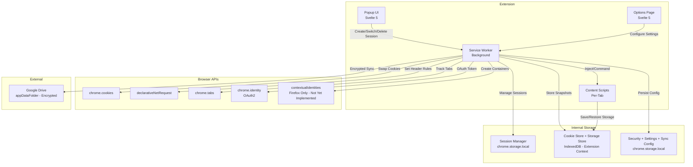
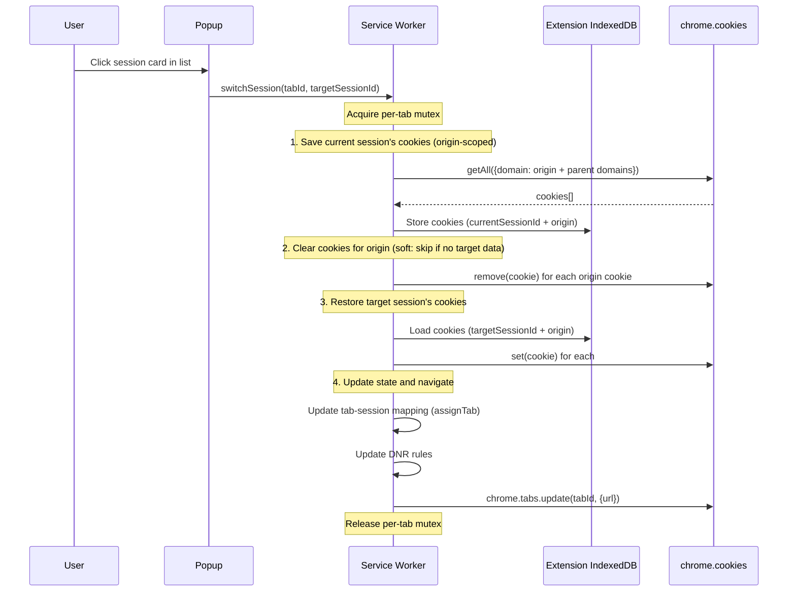
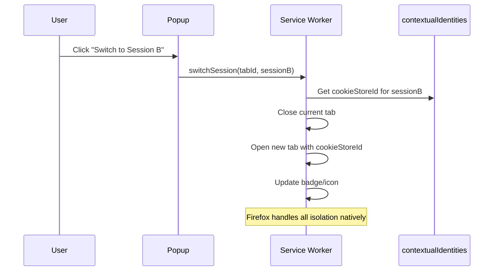

# Unaware Sessions — Product Specifications

**Version:** 1.1.0  
**Status:** Active  
**Last Updated:** 2026-04-18

---

## 1. Overview

Unaware Sessions is a privacy-first, open-source browser extension that provides isolated browsing sessions within a single browser window. Each session maintains its own cookies, localStorage, sessionStorage, and IndexedDB — all stored locally by default. An optional Google Drive sync keeps sessions in sync across devices, with all data encrypted end-to-end (AES-256-GCM) before leaving the device.

**Target:** Manifest V3 (mandatory for Chrome Web Store distribution).  
**Published:** [Chrome Web Store](https://chromewebstore.google.com/detail/unaware-sessions/pfpfakjgmkfmcimgknmnebloclkbfhbh)

---

## 2. Design Constraints

These constraints were derived from platform limitations and architectural trade-offs:

| Constraint | Rationale |
|---|---|
| **Page reload on session switch** | DOM storage (localStorage, sessionStorage, IndexedDB) cannot be swapped under a running page without race conditions and stale JS references. Reload ensures clean state. |
| **One active session per origin at a time** | DOM storage is shared per-origin across all tabs. Two tabs on `gmail.com` with different sessions would corrupt each other's storage. |
| **Manifest V3 only** | MV2 is blocked from Chrome Web Store (since June 2024). No reason to maintain two architectures. |
| **No persistent background page** | MV3 service workers die after ~30s idle. All state must survive restarts via `chrome.storage` or IndexedDB. |

---

## 3. Platform Strategy

### 3.1 Chromium (Chrome, Edge, Brave, Opera)

No `contextualIdentities` API available. Session isolation is achieved through **Snapshot & Swap**:

- **HTTP Cookies** — `chrome.cookies` API (full read/write/delete per domain)
- **localStorage / sessionStorage** — Content script save/restore on reload
- **IndexedDB** — Content script save/restore on reload (best-effort)
- **Cache API** — Content script save/restore on reload (best-effort)

Cookie swap uses **origin-scoped** save/clear/restore with domain hierarchy walk (e.g., both `mail.google.com` and `.google.com` cookies are captured). No cross-domain cookies are saved or restored — each origin's cookie set is self-contained.

**Cookie isolation modes:**

- **Soft** (default) — skips cookie clear/restore on domains where the target session has no saved data, preserving unrelated services (e.g., switching sessions on `gmail.com` won't wipe `github.com` cookies)
- **Strict** — always clears cookies for full isolation even without target session data

Configurable globally and per-domain via the Settings tab.

Cookie header manipulation via `declarativeNetRequest` dynamic rules for outbound request isolation. Per-tab session switch mutex serializes concurrent switches on the same tab to prevent interleaved cookie operations.

### 3.2 Firefox

Firefox provides `browser.contextualIdentities` API, which offers **real kernel-level cookie jar isolation**. The extension should use this API directly when available, falling back to Snapshot & Swap only for storage layers not covered by contextual identities. (Not yet implemented — planned for future release)

### 3.3 Isolation Matrix

| Data Layer | Chromium Method | Firefox Method | Isolation Level |
|---|---|---|---|
| HTTP Cookies | `chrome.cookies` swap + DNR rules | `contextualIdentities` (native) | **Full** |
| localStorage | Content script save/clear/restore | `contextualIdentities` (native) | **Full on Firefox, best-effort on Chromium** |
| sessionStorage | Content script save/clear/restore | `contextualIdentities` (native) | **Full on Firefox, best-effort on Chromium** |
| IndexedDB | Content script save/clear/restore | `contextualIdentities` (native) | **Best-effort** |
| Cache API | Content script save/clear/restore | Content script save/clear/restore | **Best-effort** |
| Service Workers | **Not isolated** | **Not isolated** | None |
| Browser Fingerprint | **Not isolated** | **Not isolated** | None |
| BroadcastChannel / SharedWorker | **Not isolated** | **Not isolated** | None |

> **Best-effort** = works for most sites, may fail on complex apps with large IndexedDB schemas or active transactions during swap.

---

## 4. Architecture

### 4.1 High-Level Component Diagram



### 4.2 Core Components

#### 4.2.1 Service Worker (Background)

**Responsibilities:**

- Session lifecycle management (create, switch, delete, duplicate, batch upsert)
- Tab-to-session mapping with persistence (survives SW restarts)
- Cookie swap orchestration on session switch (per-tab mutex, soft/strict isolation)
- `declarativeNetRequest` rule management for cookie header isolation
- Context menu registration ("Open in Session")
- Badge/icon updates per tab (session color + abbreviation)
- Message broker between popup, content scripts, and storage
- Auto-refresh: alarm-driven periodic session data save for tracked tabs
- Google Drive sync orchestration (alarm-based auto-sync, conflict triggers)
- Tab unassignment on cross-origin navigation

**State persistence strategy:**

- Tab-session mapping — `chrome.storage.session` (survives SW restart within browser session)
- Session profiles — `chrome.storage.local` (survives browser restart)
- Cookie + storage snapshots — Extension-context IndexedDB (large data, structured)
- Settings, security config, sync config — `chrome.storage.local`
- Grace period state — `chrome.storage.session` (auto-clears on browser close)

#### 4.2.2 Content Scripts

**Injection:** `document_start` (critical — must run before page scripts)

**Responsibilities:**

- On SW message `saveStorage` (triggered by manual refresh or auto-refresh):
  1. Save current origin's localStorage, sessionStorage to extension store
  2. Save IndexedDB snapshot (best-effort)
- On SW message `restoreStorage` (triggered on page load after session switch):
  1. Clear origin's localStorage, sessionStorage
  2. Restore target session's data from extension store
- IndexedDB snapshot/restore (best-effort):
  1. Enumerate databases via `indexedDB.databases()`
  2. Read all object stores and records
  3. Encode binary values (`ArrayBuffer`, `TypedArray`, `Date`) into JSON-safe markers before `sendMessage` (Chrome extension messaging uses JSON serialization, not structured clone)
  4. Decode markers back to native types on restore
  5. Clear and recreate databases with target session data
- Report storage size metrics to SW for UI display

#### 4.2.3 Popup UI (Svelte 5)

**Width:** 380px, natural document scroll (Chrome popup viewport is the single scroll owner)

**Views:**

- Header with app logo, theme toggle
- Current tab panel (origin, favicon, refresh button, auto-refresh toggle with green status indicator)
- Session list with domain grouping ("This Site" / "Other Sessions"), search by session name or domain
- "Default (no session)" option for clean browsing / fresh login
- New session form (name, color picker, emoji picker)
- Session management: inline rename, delete with undo, duplicate, pin, context menu
- Quick-switch overlay — press `?` then a number key to jump to a session
- Keyboard shortcuts: `n` (new), `/` (search), `?` (quick-switch), `Escape` (close)
- Onboarding empty state for first-run users
- `withAuth` gate on session switch/delete when passcode/biometric is enabled

#### 4.2.4 Options Page (Svelte 5)

**Tabs:**

- **Sessions** — Domain folders, inline cookie/storage editing, per-domain auto-refresh, search by session name or domain
- **Settings** — Theme, cookie isolation mode (soft/strict), auto-refresh interval, security settings (passcode + biometric), Cloud Sync card (connect/disconnect, merge strategy, auto-sync interval)
- **Data** — Profile-only + full export/import with stats preview, drag-and-drop import, data management / clear all, `withAuth` gate on export/import/clear
- **Debug** — Cookie diff viewer, restore failure log, extension logs with log level selector
- **About** — Version, GitHub link, OpenCollective donation

### 4.3 Session Switch Flow (Chromium)

The user clicks a session card in the popup session list. The switch is entirely orchestrated by the service worker — no content script interaction occurs during the switch itself. DOM storage (localStorage, sessionStorage, IndexedDB) is saved separately via the manual "Refresh session data" button or auto-refresh, not as part of the switch flow. A per-tab mutex serializes concurrent switches on the same tab to prevent interleaved cookie operations.



### 4.4 Session Switch Flow (Firefox)

(Not yet implemented)



---

## 5. Data Model

### 5.1 Session Profile

```typescript
interface SessionProfile {
  id: string;                  // UUID v4
  name: string;                // User-defined label
  color: string;               // Hex color for badge/UI
  emoji?: string;              // Optional emoji icon for session
  pinned?: boolean;            // Pin session to top of list
  createdAt: number;           // Unix timestamp
  updatedAt: number;           // Unix timestamp
  settings: SessionSettings;
}

interface SessionSettings {
  userAgent?: string;          // Custom User-Agent override
  headers?: Record<string, string>; // Custom request headers
}
```

### 5.2 Tab-Session Mapping

```typescript
interface TabSessionMap {
  [tabId: number]: {
    sessionId: string;
    origin: string;
  };
}
```

### 5.3 Storage Snapshot

```typescript
interface StorageSnapshot {
  sessionId: string;
  origin: string;
  timestamp: number;
  localStorage: Record<string, string>;
  sessionStorage: Record<string, string>;
  indexedDB?: IndexedDBSnapshot[];  // Best-effort
}

interface IndexedDBSnapshot {
  name: string;
  version: number;
  objectStores: ObjectStoreSnapshot[];
}

interface ObjectStoreSnapshot {
  name: string;
  keyPath: string | string[] | null;
  autoIncrement: boolean;
  indexes: IndexSnapshot[];
  records: Record<string, unknown>[];
}

interface IndexSnapshot {
  name: string;
  keyPath: string | string[];
  unique: boolean;
  multiEntry: boolean;
}
```

### 5.4 Cookie Snapshot

```typescript
interface CookieSnapshot {
  sessionId: string;
  origin: string;
  timestamp: number;
  cookies: chrome.cookies.Cookie[];
}
```

### 5.5 Security Config

```typescript
type IsolationMode = 'soft' | 'strict';

type GracePeriodMs = 60000 | 120000 | 300000 | 600000 | 1800000; // 1m–30m

interface SecurityConfig {
  passcodeHash: string;          // PBKDF2-SHA256 hash (empty = disabled)
  passcodeSalt: string;          // Random salt for PBKDF2
  biometricEnabled: boolean;     // WebAuthn platform authenticator
  biometricCredentialId: string; // Stored credential ID
  gracePeriodMs: GracePeriodMs;  // Skip re-auth window
}
```

### 5.6 Sync Types

```typescript
type MergeStrategy = 'trust-cloud' | 'trust-local' | 'ask';
type SyncInterval = 0 | 5 | 15 | 30;

interface SyncConfig {
  enabled: boolean;
  mergeStrategy: MergeStrategy;
  syncInterval: SyncInterval;
  lastSyncAt: number;
  lastSyncError: string;
  deviceId: string;
  googleId: string;
}

interface SyncManifest {
  version: 1;
  updatedAt: number;
  deviceId: string;
  checksums: Record<string, string>;       // "sessionId:origin" → hash
  sessionChecksums: Record<string, string>; // sessionId → hash
}

interface EncryptedPayload {
  v: 1;
  salt: string;  // Base64
  iv: string;    // Base64
  ct: string;    // Base64 ciphertext (AES-256-GCM)
}

interface ConflictEntry {
  sessionId: string;
  sessionName: string;
  origin: string;
  localTimestamp: number;
  cloudTimestamp: number;
  resolution: 'local' | 'cloud' | null;
}
```

### 5.7 Full Export Data

```typescript
interface FullExportData {
  version: 1;
  exportedAt: number;
  sessions: SessionProfile[];
  cookieSnapshots: CookieSnapshot[];
  storageSnapshots: StorageSnapshot[];
}
```

---

## 6. Extension Permissions

```json
{
  "permissions": [
    "storage",
    "cookies",
    "tabs",
    "declarativeNetRequest",
    "contextMenus",
    "alarms",
    "favicon",
    "identity"
  ],
  "host_permissions": ["<all_urls>"],
  "oauth2": {
    "scopes": ["https://www.googleapis.com/auth/drive.appdata"]
  }
}
```

| Permission | Purpose |
|---|---|
| `storage` | Persist session profiles, tab mappings, settings, security config |
| `cookies` | Read/write/delete cookies per domain for session swap |
| `tabs` | Track tab lifecycle, reload tabs, update badges |
| `declarativeNetRequest` | Modify cookie headers on outbound requests |
| `contextMenus` | "Open in Session" right-click menu |
| `alarms` | Auto-refresh, auto-sync, periodic cleanup |
| `favicon` | Display site icons in popup via _favicon API |
| `identity` | OAuth2 token for Google Drive sync |
| `drive.appdata` (OAuth2 scope) | Hidden app folder on Google Drive — no access to user files |

---

## 7. Tech Stack

| Layer | Technology | Role |
|---|---|---|
| Extension Runtime | WebExtensions API (MV3) | Cross-browser extension framework |
| UI Framework | Svelte 5 (runes) | Popup & options interface |
| Build System | Vite + @crxjs/vite-plugin | Dev server, HMR, extension bundling |
| Language | TypeScript (strict) | End-to-end type safety |
| Internal Storage | chrome.storage.local + chrome.storage.session + IndexedDB | Session profiles, tab mappings, cookie/storage snapshots |
| Styling | CSS custom properties | Design system tokens with light/dark themes |
| Security | Web Crypto (PBKDF2-SHA256) + WebAuthn | Passcode hashing, biometric auth |
| Optional Sync | Google Drive REST v3 (`drive.appdata`) + Web Crypto (AES-256-GCM) | Opt-in encrypted session sync |
| Testing | Vitest + fake-indexeddb | Unit tests with Chrome API mocks (467+ tests) |
| Linting | ESLint + Prettier | Code quality |

---

## 8. UI Wireframes (Conceptual)

### 8.1 Popup — Session List

```text
+-------------------------------+
|  [logo] Unaware Sessions [sun]|
+-------------------------------+
|  gmail.com  [auto] [refresh]  |
+-------------------------------+
|  [/ Search sessions...]       |
+-------------------------------+
|                               |
|  o Default (no session)       |
|                               |
|  THIS SITE                    |
|  📧 work-gmail    [pin] [3]  |
|  👤 client-A            [1]  |
|                               |
|  OTHER SESSIONS (2)        v  |
|  o 🧪 staging           [2]  |
|  o 🏠 personal               |
|                               |
+-------------------------------+
|  [+ New Session]    n / ? Esc |
+-------------------------------+

📧 = emoji avatar
[pin] = pinned session
[3] = tab count
[auto] = auto-refresh toggle (green when active)
[refresh] = manual save session data
[sun] = theme toggle (light/dark/system)
n = new, / = search, ? = quick-switch, Esc = close
v = expand/collapse toggle
```

### 8.2 Popup — New Session

```text
+-------------------------------+
|  <- New Session               |
+-------------------------------+
|                               |
|  Name: [__________________]   |
|                               |
|  Color: * * * * * * * *       |
|                               |
|  Emoji: 😀 📧 👤 🧪 🏠 ...  |
|                               |
|  [Create Session]             |
|                               |
+-------------------------------+
```

### 8.3 Context Menu

```
Right-click on link:
+-- Open in New Tab
+-- Open in New Window
+-- ...
+-- Open in Session >
    +-- work-gmail
    +-- client-A
    +-- staging
    +-- + New Session...
```

---

## 9. Known Limitations

| Limitation | Impact | Mitigation |
|---|---|---|
| One session per origin at a time | Cannot have two Gmail tabs in different sessions simultaneously | Clear UX messaging. User must switch, not parallel-use. |
| Page reload on switch | Brief interruption when changing sessions | Fast swap (~100ms for cookies + small storage). Reload is expected behavior. |
| IndexedDB restore may fail on complex schemas | Apps with large/complex IDB (Gmail, Slack) may not restore perfectly | Best-effort with user warning. Cookie isolation alone covers most login scenarios. |
| Content script race condition | Tiny window where page scripts could access un-restored storage | `document_start` injection minimizes this. Acceptable trade-off. |
| Service Worker lifecycle (MV3) | Background state lost on SW termination | All state persisted to `chrome.storage.session` and `chrome.storage.local`. Hydrate on wake. |
| DNR rule limits | ~5,000 dynamic rules max on Chromium | Monitor usage. Prune stale rules. Sufficient for typical use (tens of sessions). |
| Untouchable layers | Service Workers, fingerprint, BroadcastChannel not isolated | Document clearly. Not solvable at extension level. |

---

## 10. Future Work

These features are deferred to future releases.

> **Implemented since v1:** Drive Sync (now Section 5.6 / 4.2.1), Passcode + Biometric Lock (now Section 5.5), Cookie Isolation Modes, Auto-Refresh, Debugging Tools.

### 10.1 Firefox `contextualIdentities` Integration

Use Firefox's native container isolation where available, falling back to Snapshot & Swap only for storage layers not covered by contextual identities. Provides kernel-level cookie jar isolation without content script overhead.

**Approach:**

- Detect Firefox at runtime; create/delete `contextualIdentities` (containers) mapped to session profiles
- On session switch: open new tab with `cookieStoreId` instead of cookie swap
- Adapt popup UI: hide storage isolation indicators (Firefox handles natively)

### 10.2 Per-Session Proxy Routing

HTTP/SOCKS5 proxy configuration per session for IP-level isolation.

**Approach:**

- Proxy settings stored in `SessionSettings`
- Implemented via `chrome.proxy` API (Chromium) or proxy PAC scripts (Firefox)
- Each session's network traffic routed through its configured proxy
- Provides IP-level isolation complementary to cookie/storage isolation

**Requires:** Careful handling of DNS leaks, WebRTC leak prevention, and proxy authentication.

### 10.3 Session Templates

Pre-configured groups of tabs + session pairings for common workflows. One-click launch of entire work contexts (e.g., open 4 client dashboards each in their own session).

### 10.4 Request Header Injection

Per-session custom request headers — useful for staging auth tokens, API keys, or custom debug headers. Implemented via `declarativeNetRequest` rules scoped to session.

### 10.5 Per-Session User-Agent Override

Configurable User-Agent string per session for device/browser spoofing during QA and cross-environment testing. The `SessionSettings.userAgent` field is reserved in the type model but not yet wired up end-to-end.

### 10.6 Encrypted Local Export

Optional AES-256-GCM encryption with user-provided passphrase for local JSON export files. Currently, local exports are unencrypted (Drive sync uses encryption, but local file export does not).
