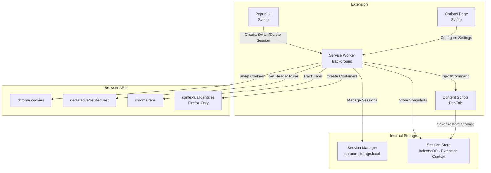
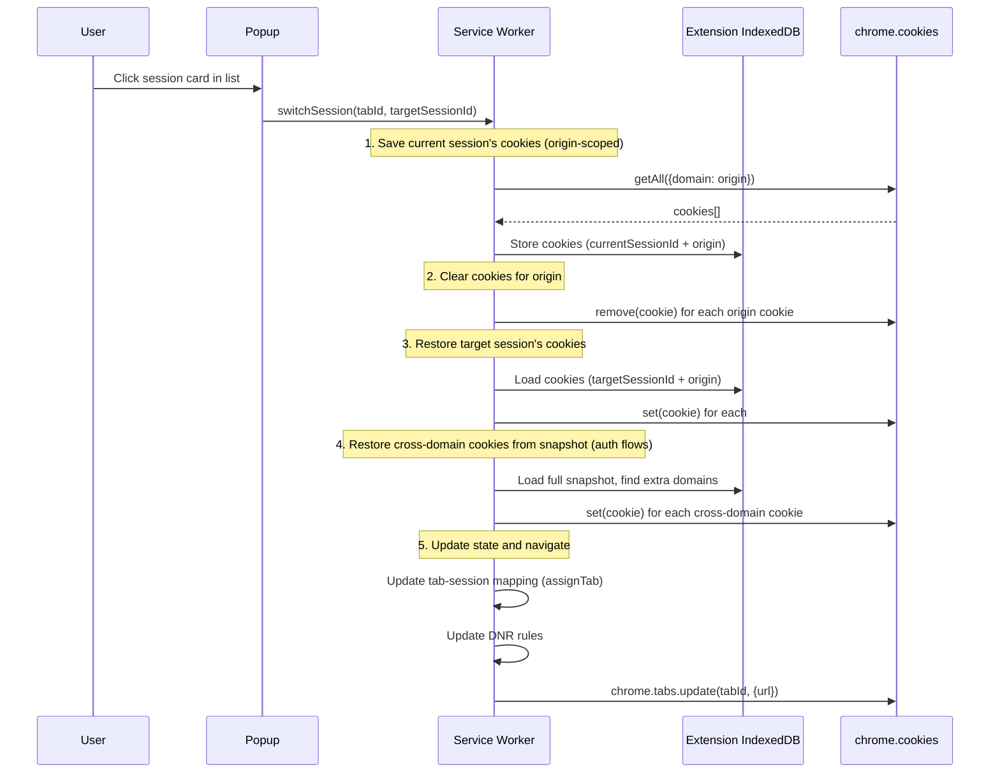
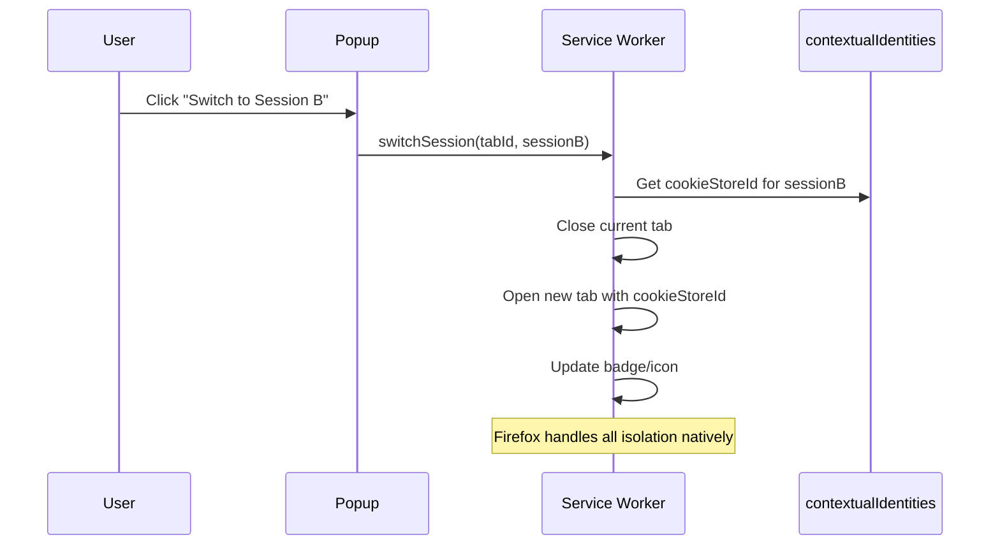

# Unaware Sessions — Product Specifications

**Version:** 0.1.0  
**Status:** Draft  
**Last Updated:** 2026-04-07

---

## 1. Overview

Unaware Sessions is a privacy-first, open-source browser extension that provides isolated browsing sessions within a single browser window. Each session maintains its own cookies, localStorage, sessionStorage, and IndexedDB — all stored locally, with zero network calls.

**Target:** Manifest V3 (mandatory for Chrome Web Store distribution).

---

## 2. Design Constraints

These constraints were derived from platform limitations and architectural trade-offs:

| Constraint | Rationale |
|---|---|
| **Page reload on session switch** | DOM storage (localStorage, sessionStorage, IndexedDB) cannot be swapped under a running page without race conditions and stale JS references. Reload ensures clean state. |
| **One active session per origin at a time** | DOM storage is shared per-origin across all tabs. Two tabs on `gmail.com` with different sessions would corrupt each other's storage. |
| **Manifest V3 only** | MV2 is blocked from Chrome Web Store (since June 2024). No reason to maintain two architectures. |
| **No persistent background page** | MV3 service workers die after ~30s idle. All state must survive restarts via `chrome.storage` or IndexedDB. |

---

## 3. Platform Strategy

### 3.1 Chromium (Chrome, Edge, Brave, Opera)

No `contextualIdentities` API available. Session isolation is achieved through **Snapshot & Swap**:

- **HTTP Cookies** — `chrome.cookies` API (full read/write/delete per domain)
- **localStorage / sessionStorage** — Content script save/restore on reload
- **IndexedDB** — Content script save/restore on reload (best-effort)
- **Cache API** — Content script save/restore on reload (best-effort)

Cookie swap uses origin-scoped save/clear/restore. When a session snapshot contains cross-domain cookies (e.g., `anthropic.com` for `claude.ai`, `authenticator.cursor.sh` for `cursor.com`), those are also restored during session switch to preserve auth flows that span multiple domains.

Cookie header manipulation via `declarativeNetRequest` dynamic rules for outbound request isolation.

### 3.2 Firefox

Firefox provides `browser.contextualIdentities` API, which offers **real kernel-level cookie jar isolation**. The extension should use this API directly when available, falling back to Snapshot & Swap only for storage layers not covered by contextual identities. (Not yet implemented — planned for future release)

### 3.3 Isolation Matrix

| Data Layer | Chromium Method | Firefox Method | Isolation Level |
|---|---|---|---|
| HTTP Cookies | `chrome.cookies` swap + DNR rules | `contextualIdentities` (native) | **Full** |
| localStorage | Content script save/clear/restore | `contextualIdentities` (native) | **Full on Firefox, best-effort on Chromium** |
| sessionStorage | Content script save/clear/restore | `contextualIdentities` (native) | **Full on Firefox, best-effort on Chromium** |
| IndexedDB | Content script save/clear/restore | `contextualIdentities` (native) | **Best-effort** |
| Cache API | Content script save/clear/restore | Content script save/clear/restore | **Best-effort** |
| Service Workers | **Not isolated** | **Not isolated** | None |
| Browser Fingerprint | **Not isolated** | **Not isolated** | None |
| BroadcastChannel / SharedWorker | **Not isolated** | **Not isolated** | None |

> **Best-effort** = works for most sites, may fail on complex apps with large IndexedDB schemas or active transactions during swap.

---

## 4. Architecture

### 4.1 High-Level Component Diagram



### 4.2 Core Components

#### 4.2.1 Service Worker (Background)

**Responsibilities:**

- Session lifecycle management (create, switch, delete)
- Tab-to-session mapping with persistence (survives SW restarts)
- Cookie swap orchestration on session switch
- `declarativeNetRequest` rule management for cookie header isolation
- Context menu registration ("Open in Session")
- Badge/icon updates per tab
- Message broker between popup, content scripts, and storage

**State persistence strategy:**

- Tab-session mapping — `chrome.storage.session` (survives SW restart within browser session)
- Session profiles — `chrome.storage.local` (survives browser restart)
- Storage snapshots — Extension-context IndexedDB (large data, structured)

#### 4.2.2 Content Scripts

**Injection:** `document_start` (critical — must run before page scripts)

**Responsibilities:**

- On session switch (triggered by SW message):
  1. Save current origin's localStorage, sessionStorage to extension store
  2. Clear origin's localStorage, sessionStorage
  3. Restore target session's data from extension store
- IndexedDB snapshot/restore (best-effort):
  1. Enumerate databases via `indexedDB.databases()`
  2. Read all object stores and records
  3. Clear and recreate with target session data
- Report storage size metrics to SW for UI display

#### 4.2.3 Popup UI (Svelte)

**Views:**

- Session list (name, color, active origin count)
- New session form (name, color picker)
- Current tab info (active session, origin)
- Quick switch: select session — triggers reload + swap
- Session management (rename, delete, duplicate)

#### 4.2.4 Options Page (Svelte)

**Views:**

- Session profile management (bulk operations)
- Import / Export (JSON, optionally encrypted)
- Per-session settings (User-Agent override, custom headers)
- Data management (clear all sessions, storage usage stats)

### 4.3 Session Switch Flow (Chromium)

The user clicks a session card in the popup session list. The switch is entirely orchestrated by the service worker — no content script interaction occurs during the switch itself. DOM storage (localStorage, sessionStorage, IndexedDB) is saved separately via the manual "Refresh session data" button, not as part of the switch flow.



### 4.4 Session Switch Flow (Firefox)

(Not yet implemented)



---

## 5. Data Model

### 5.1 Session Profile

```typescript
interface SessionProfile {
  id: string;                  // UUID v4
  name: string;                // User-defined label
  color: string;               // Hex color for badge/UI
  emoji?: string;              // Optional emoji icon for session
  pinned?: boolean;            // Pin session to top of list
  createdAt: number;           // Unix timestamp
  updatedAt: number;           // Unix timestamp
  settings: SessionSettings;
}

interface SessionSettings {
  userAgent?: string;          // Custom User-Agent override
  headers?: Record<string, string>; // Custom request headers
}
```

### 5.2 Tab-Session Mapping

```typescript
interface TabSessionMap {
  [tabId: number]: {
    sessionId: string;
    origin: string;
  };
}
```

### 5.3 Storage Snapshot

```typescript
interface StorageSnapshot {
  sessionId: string;
  origin: string;
  timestamp: number;
  localStorage: Record<string, string>;
  sessionStorage: Record<string, string>;
  indexedDB?: IndexedDBSnapshot[];  // Best-effort
}

interface IndexedDBSnapshot {
  name: string;
  version: number;
  objectStores: ObjectStoreSnapshot[];
}

interface ObjectStoreSnapshot {
  name: string;
  keyPath: string | string[] | null;
  autoIncrement: boolean;
  indexes: IndexSnapshot[];
  records: Record<string, unknown>[];
}

interface IndexSnapshot {
  name: string;
  keyPath: string | string[];
  unique: boolean;
  multiEntry: boolean;
}
```

### 5.4 Cookie Snapshot

```typescript
interface CookieSnapshot {
  sessionId: string;
  origin: string;
  timestamp: number;
  cookies: chrome.cookies.Cookie[];
}
```

---

## 6. Extension Permissions

```json
{
  "permissions": [
    "storage",
    "cookies",
    "tabs",
    "activeTab",
    "scripting",
    "declarativeNetRequest",
    "declarativeNetRequestFeedback",
    "contextMenus",
    "alarms",
    "favicon"
  ],
  "host_permissions": ["<all_urls>"]
}
```

| Permission | Purpose |
|---|---|
| `storage` | Persist session profiles and tab mappings |
| `cookies` | Read/write/delete cookies per domain for session swap |
| `tabs` | Track tab lifecycle, reload tabs, update badges |
| `activeTab` | Access current tab for session operations |
| `scripting` | Inject content scripts dynamically |
| `declarativeNetRequest` | Modify cookie headers on outbound requests |
| `declarativeNetRequestFeedback` | Debug DNR rule matches |
| `contextMenus` | "Open in Session" right-click menu |
| `alarms` | Periodic cleanup, session auto-save |
| `favicon` | Display site icons in popup via _favicon API |

---

## 7. Tech Stack

| Layer | Technology | Role |
|---|---|---|
| Extension Runtime | WebExtensions API (MV3) | Cross-browser extension framework |
| UI Framework | Svelte 5 | Popup, options page, sidebar |
| Build System | Vite + @crxjs/vite-plugin | Dev server, HMR, packaging |
| Language | TypeScript | End-to-end type safety |
| Internal Storage | chrome.storage.local + IndexedDB | Session profiles + storage snapshots |
| Styling | CSS Custom Properties | Scoped, minimal styles |
| Testing | Vitest + fake-indexeddb | Unit + mock storage |
| Linting | ESLint + Prettier | Code quality |

---

## 8. UI Wireframes (Conceptual)

### 8.1 Popup — Session List

```
+-------------------------------+
|  Unaware Sessions        [gear]|
+-------------------------------+
|  gmail.com          [refresh] |
+-------------------------------+
|                               |
|  o Default (no session)       |
|                               |
|  THIS SITE                    |
|  * work-gmail           [3]   |
|  * client-A             [1]   |
|                               |
|  OTHER SESSIONS (2)        v  |
|  o staging              [2]   |
|  o personal                   |
|                               |
+-------------------------------+
|  [+ New Session]              |
+-------------------------------+

* = active on this tab
o = inactive / other origin
[3] = tab count
[refresh] = save session data
[gear] = settings/options
v = expand/collapse toggle
```

### 8.2 Popup — New Session

```
+-------------------------------+
|  <- New Session               |
+-------------------------------+
|                               |
|  Name: [__________________]   |
|                               |
|  Color: * * * * * * * *       |
|                               |
|  [Create Session]             |
|                               |
+-------------------------------+
```

### 8.3 Context Menu

```
Right-click on link:
+-- Open in New Tab
+-- Open in New Window
+-- ...
+-- Open in Session >
    +-- work-gmail
    +-- client-A
    +-- staging
    +-- + New Session...
```

---

## 9. Known Limitations

| Limitation | Impact | Mitigation |
|---|---|---|
| One session per origin at a time | Cannot have two Gmail tabs in different sessions simultaneously | Clear UX messaging. User must switch, not parallel-use. |
| Page reload on switch | Brief interruption when changing sessions | Fast swap (~100ms for cookies + small storage). Reload is expected behavior. |
| IndexedDB restore may fail on complex schemas | Apps with large/complex IDB (Gmail, Slack) may not restore perfectly | Best-effort with user warning. Cookie isolation alone covers most login scenarios. |
| Content script race condition | Tiny window where page scripts could access un-restored storage | `document_start` injection minimizes this. Acceptable trade-off. |
| Service Worker lifecycle (MV3) | Background state lost on SW termination | All state persisted to `chrome.storage.session` and `chrome.storage.local`. Hydrate on wake. |
| DNR rule limits | ~5,000 dynamic rules max on Chromium | Monitor usage. Prune stale rules. Sufficient for typical use (tens of sessions). |
| Untouchable layers | Service Workers, fingerprint, BroadcastChannel not isolated | Document clearly. Not solvable at extension level. |

---

## 10. Future Work

These features are explicitly **out of scope for v1** and deferred to future releases.

### 10.1 Drive Sync (Encrypted Cloud Sync)

Opt-in module that syncs encrypted session profiles to a user-chosen cloud drive folder. The extension itself makes **zero direct network calls** — sync is mediated entirely through the drive's local client folder.

**Approach:**

- Session profiles serialized, encrypted (AES-256-GCM) with user passphrase, written to a local folder (e.g., `~/Google Drive/Unaware Sessions/`)
- The cloud drive's desktop client handles upload/download
- On another machine, the extension watches the same folder and imports after decryption
- Conflict resolution: last-write-wins with merge prompt for divergent edits

**Synced:** Session profile metadata (name, color, settings), session templates.  
**Never synced:** Cookies, active session state, browsing history, DOM storage contents.

### 10.2 Per-Session Proxy Routing

HTTP/SOCKS5 proxy configuration per session for IP-level isolation.

**Approach:**

- Proxy settings stored in `SessionSettings`
- Implemented via `chrome.proxy` API (Chromium) or proxy PAC scripts
- Each session's network traffic routed through its configured proxy
- Provides IP-level isolation complementary to cookie/storage isolation

**Requires:** Careful handling of DNS leaks, WebRTC leak prevention, proxy authentication.

### 10.3 Session Templates

Pre-configured groups of tabs + session pairings for common workflows. One-click launch of entire work contexts.

### 10.4 Request Header Injection

Per-session custom request headers (useful for staging auth tokens, API keys). Implemented via `declarativeNetRequest` rules scoped to session.

### 10.5 Passphrase Lock

Optional passphrase to encrypt and lock the session vault. Requires unlock on browser start.
