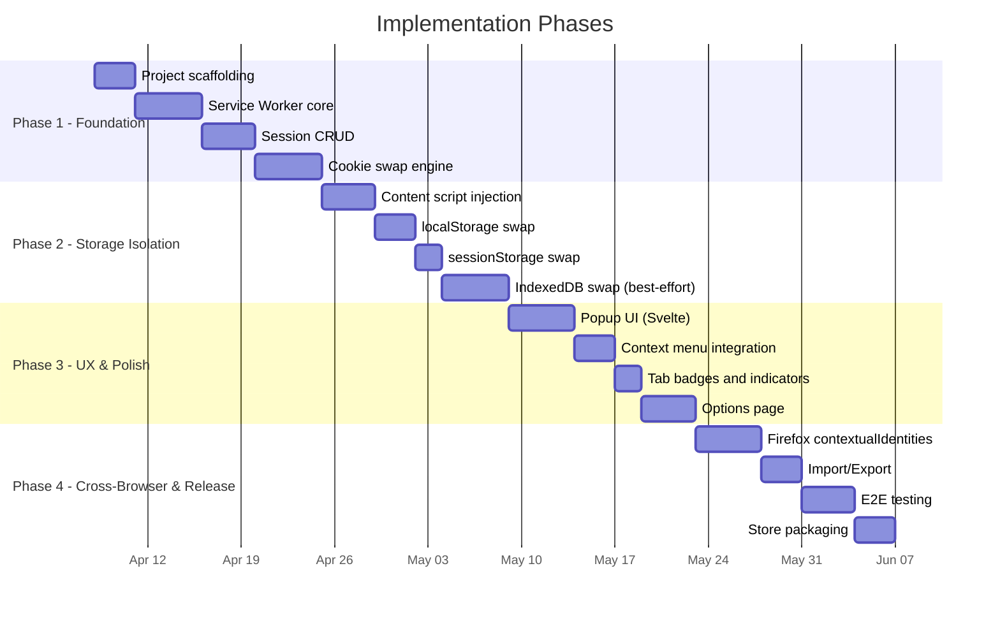
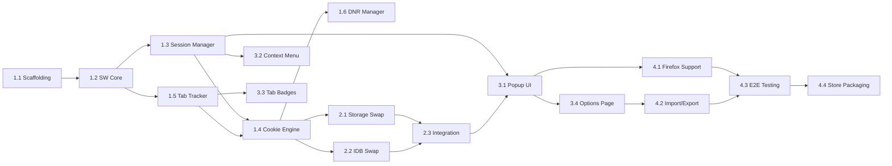

# Unaware Sessions — Implementation Plan

**Version:** 0.1.0  
**Status:** Draft  
**Last Updated:** 2026-04-07

---

## Phased Delivery

The implementation is split into 4 phases. Each phase produces a **shippable increment** — the extension works at the end of every phase, just with fewer features.



---

## Phase 1 — Foundation (Cookie Isolation)

**Goal:** Extension can create sessions and swap cookies per-tab on Chromium. No UI yet — tested via dev console and background script commands.

### 1.1 Project Scaffolding

- [ ] Initialize Vite + TypeScript project with web-ext plugin
- [ ] Configure `manifest.json` for MV3 (permissions, service worker, content scripts)
- [ ] Set up ESLint + Prettier with shared config
- [ ] Set up Vitest for unit tests
- [ ] Create folder structure:

```
src/
  background/
    service-worker.ts        # Entry point
    session-manager.ts       # Session CRUD + persistence
    cookie-engine.ts         # Cookie swap logic
    dnr-manager.ts           # declarativeNetRequest rules
    tab-tracker.ts           # Tab-session mapping
    messaging.ts             # Message router
  content/
    index.ts                 # Content script entry
    storage-swap.ts          # localStorage/sessionStorage save/restore
    idb-swap.ts              # IndexedDB save/restore (best-effort)
  popup/
    index.html
    App.svelte
    components/
  options/
    index.html
    App.svelte
  shared/
    types.ts                 # Shared interfaces
    constants.ts             # Extension-wide constants
    storage.ts               # chrome.storage helpers
    utils.ts                 # Shared utilities
  assets/
    icons/
```

### 1.2 Service Worker Core

- [ ] Implement SW lifecycle management (install, activate, wake)
- [ ] State hydration from `chrome.storage.session` on SW wake
- [ ] Message router: receive messages from popup/content scripts, dispatch to handlers
- [ ] `chrome.alarms` for periodic state persistence (backup every 60s)

### 1.3 Session Manager

- [ ] `createSession(name, color)` — generate UUID, store profile in `chrome.storage.local`
- [ ] `deleteSession(id)` — remove profile, clean up all snapshots for that session
- [ ] `listSessions()` — return all session profiles
- [ ] `updateSession(id, partial)` — rename, recolor
- [ ] `getSessionForTab(tabId)` — lookup from tab-session map

### 1.4 Cookie Swap Engine

- [ ] `saveCookies(sessionId, origin)` — `chrome.cookies.getAll({domain})` → store in extension IndexedDB
- [ ] `clearCookies(origin)` — `chrome.cookies.remove()` for all cookies on origin
- [ ] `restoreCookies(sessionId, origin)` — load from extension IndexedDB → `chrome.cookies.set()` each
- [ ] `switchSession(tabId, targetSessionId)` — orchestrate: save current → clear → restore target → reload tab
- [ ] Handle subdomain cookies (`.gmail.com` vs `mail.gmail.com`)
- [ ] Handle `Secure`, `SameSite`, `HttpOnly` attributes correctly on restore

### 1.5 Tab Tracker

- [ ] Listen to `chrome.tabs.onCreated`, `onRemoved`, `onUpdated`
- [ ] Maintain `tabId → { sessionId, origin }` mapping
- [ ] Persist mapping to `chrome.storage.session`
- [ ] Clean up mappings when tabs close
- [ ] Handle tab navigation (origin change within same tab)

### 1.6 DNR Manager

- [ ] Generate `declarativeNetRequest` dynamic rules for cookie header manipulation
- [ ] Scope rules to specific tab + session combination
- [ ] Update rules on session switch
- [ ] Monitor rule count (warn if approaching 5,000 limit)
- [ ] Clean up stale rules on session/tab removal

**Phase 1 Exit Criteria:**
- Can create 3 sessions via background script console
- Can assign a tab to a session
- Switching sessions on a tab swaps cookies and reloads
- Two different sessions on `gmail.com` produce two different logged-in states
- All state survives SW restart

---

## Phase 2 — Storage Isolation

**Goal:** Extend isolation to localStorage, sessionStorage, and IndexedDB (best-effort). Content scripts handle the DOM storage layer.

### 2.1 Content Script — Storage Swap

- [ ] Change content script `run_at` from `document_idle` to `document_start`
- [ ] On SW message `saveStorage`:
  - Read all `localStorage` keys/values → send to SW for IndexedDB storage
  - Read all `sessionStorage` keys/values → send to SW for IndexedDB storage
- [ ] On SW message `restoreStorage`:
  - Clear `localStorage` and `sessionStorage`
  - Write all keys/values from snapshot
- [ ] Handle storage quota errors (skip with warning if origin storage exceeds limits)
- [ ] Measure and report storage sizes to SW

### 2.2 Content Script — IndexedDB Swap (Best-Effort)

- [ ] Enumerate databases via `indexedDB.databases()` (check browser support)
- [ ] For each database:
  - Open with current version
  - Iterate all object stores
  - Read all records via cursor
  - Serialize to transferable format (handle Blobs, ArrayBuffers)
- [ ] Save full IDB snapshot to extension's own IndexedDB (namespaced by session + origin)
- [ ] Restore: delete existing databases → recreate with saved schema + data
- [ ] Add timeout (5s max per database) — skip and warn on slow/large databases
- [ ] Skip databases over configurable size threshold (default: 50MB)

### 2.3 Integrate with Session Switch Flow

- [ ] Update `switchSession` in cookie engine to coordinate with content script:
  1. Send `saveStorage` to content script → wait for completion
  2. Swap cookies (existing logic)
  3. Reload tab
  4. Content script at `document_start` restores target session storage
- [ ] Handle edge case: content script not yet injected (fresh tab)
- [ ] Handle edge case: content script message timeout (page unresponsive)

**Phase 2 Exit Criteria:**
- localStorage data persists across session switches
- sessionStorage data persists across session switches
- IndexedDB snapshots work on simple sites (e.g., a test page with known IDB schema)
- Complex sites (Gmail) degrade gracefully — cookie isolation still works, IDB restore skipped with warning

---

## Phase 3 — UX & Polish

**Goal:** Full popup UI, context menus, tab badges. The extension is usable by a human without dev console.

### 3.1 Popup UI (Svelte)

- [ ] Session list view:
  - Display all sessions with name, color dot, tab count
  - Active session highlighted
  - Click to expand: show tabs in that session
- [ ] New session form:
  - Name input (validate: non-empty, unique)
  - Color picker (8 preset colors + custom hex)
  - Create button
- [ ] Current tab panel:
  - Show current tab's origin and active session
  - Session switcher dropdown → triggers swap + reload
- [ ] Session management:
  - Rename (inline edit)
  - Delete (confirm dialog, warn about data loss)
  - Duplicate session profile
- [ ] Empty state: first-run onboarding prompt
- [ ] Loading states during session switch

### 3.2 Context Menu

- [ ] Register `chrome.contextMenus` on extension install
- [ ] "Open in Session" parent menu on links
- [ ] Dynamic child items: one per session + "New Session..."
- [ ] Update menu items when sessions are created/deleted
- [ ] Handle: open link in new tab with target session's cookies pre-loaded

### 3.3 Tab Badges

- [ ] Set `chrome.action.setBadgeText` with session name abbreviation (first 2 chars)
- [ ] Set `chrome.action.setBadgeBackgroundColor` with session color
- [ ] Update badge on tab focus change
- [ ] Clear badge when tab has no session (default context)

### 3.4 Options Page

- [ ] Session profile management (list, bulk delete)
- [ ] Import/Export buttons (JSON file)
- [ ] Per-session settings: User-Agent override, custom headers
- [ ] Data usage display (total storage per session)
- [ ] "Clear all data" with confirmation
- [ ] About section (version, links)

**Phase 3 Exit Criteria:**
- User can create, switch, rename, delete sessions entirely via popup UI
- Right-click "Open in Session" works on any link
- Tab badges show session identity at a glance
- Options page allows import/export and settings

---

## Phase 4 — Cross-Browser & Release

**Goal:** Firefox support via `contextualIdentities`, import/export, E2E tests, and store-ready packaging.

### 4.1 Firefox Support

- [ ] Detect Firefox at runtime (`typeof browser !== 'undefined'` + user agent)
- [ ] Firefox session manager: create/delete `contextualIdentities` (containers)
- [ ] Map session profiles to container IDs
- [ ] On session switch: open new tab with `cookieStoreId` instead of cookie swap
- [ ] Adapt popup UI: hide "storage isolation" indicators (Firefox handles natively)
- [ ] Test with `web-ext run` on Firefox

### 4.2 Import / Export

- [ ] Export: serialize all session profiles to JSON → download as file
- [ ] Import: file picker → validate JSON schema → create sessions
- [ ] Handle conflicts (duplicate session names): prompt user to rename or skip
- [ ] Optional: AES-256-GCM encryption with user-provided passphrase

### 4.3 E2E Testing

- [ ] Set up Playwright with Chrome and Firefox browser contexts
- [ ] Test scenarios:
  - Create session → open tab → verify cookies isolated
  - Switch session → verify cookies swapped + page reloaded
  - Delete session → verify cleanup
  - Context menu → open link in session
  - Import/export round-trip
  - SW restart → verify state persisted
- [ ] CI pipeline: run tests on push

### 4.4 Store Packaging

- [ ] Chrome Web Store:
  - Build with `vite build`
  - Generate `.zip` of `dist/chrome`
  - Write store listing (description, screenshots, privacy policy)
- [ ] Firefox Add-ons (AMO):
  - Build with Firefox-specific manifest adjustments
  - Generate `.zip` of `dist/firefox`
  - Submit source code for review (AMO requirement)
- [ ] Privacy policy document (already exists: `PRIVACY_POLICY.md`)
- [ ] Update `README.md` with install instructions and screenshots

**Phase 4 Exit Criteria:**
- Extension works on Chrome and Firefox
- Import/export works with optional encryption
- All E2E tests pass on both browsers
- Store-ready packages generated
- Privacy policy and listing materials complete

---

## Dependency Map



---

## Risk Register

| Risk | Likelihood | Impact | Mitigation |
| --- | --- | --- | --- |
| IndexedDB snapshot fails on complex apps (Gmail, Slack) | High | Medium | Best-effort with user warning. Cookie isolation covers login scenarios. IDB is a bonus, not a requirement. |
| DNR rule limit reached with many sessions | Low | Medium | Monitor count, prune stale rules, warn user at 80% capacity. |
| Content script race condition on storage restore | Medium | Low | `document_start` injection. Acceptable for v1 — most sites init storage after DOM ready. |
| SW killed mid-swap (MV3 lifecycle) | Medium | High | Make swap operations atomic: persist each step's completion state. Resume on SW wake if interrupted. |
| Chrome Web Store review rejects `<all_urls>` | Low | High | Justify in review notes: cookie/storage access requires broad host permissions. Precedent: SessionBox, Multi-Account Containers. |
| `indexedDB.databases()` not supported in all browsers | Medium | Low | Feature-detect. Skip IDB enumeration where unavailable. Does not block core functionality. |
