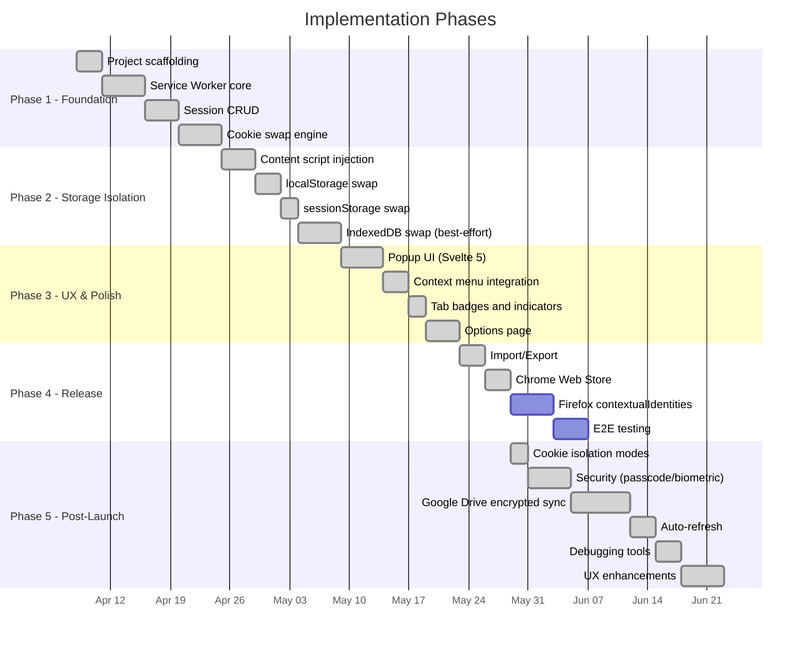
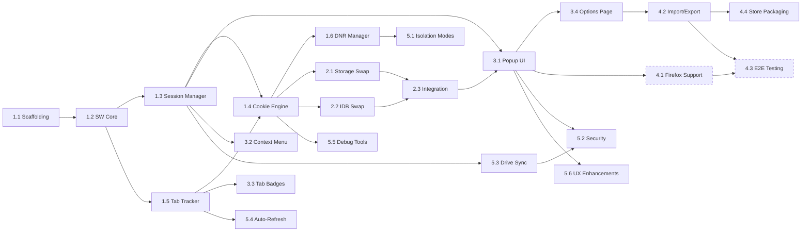

# Unaware Sessions — Implementation Plan

**Version:** 1.1.0
**Status:** Active
**Last Updated:** 2026-04-18

---

## Phased Delivery

The implementation is split into 5 phases. Each phase produces a **shippable increment** — the extension works at the end of every phase, just with fewer features. Phases 1–3 and Phase 5 are complete. Phase 4 is partially complete (Chrome Web Store published; Firefox support and E2E testing remain).



---

## Phase 1 — Foundation (Cookie Isolation)

**Goal:** Extension can create sessions and swap cookies per-tab on Chromium. No UI yet — tested via dev console and background script commands.

### 1.1 Project Scaffolding

- [x] Initialize Vite + TypeScript project with web-ext plugin
- [x] Configure `manifest.json` for MV3 (permissions, service worker, content scripts)
- [x] Set up ESLint + Prettier with shared config
- [x] Set up Vitest for unit tests
- [x] Create folder structure:

```text
src/
  background/
    service-worker.ts        # Entry point, lifecycle, init
    session-manager.ts       # Session CRUD, ordering, batch upsert
    cookie-engine.ts         # Cookie swap, switch mutex, restore tracking
    cookie-store.ts          # IndexedDB wrapper for cookie snapshots
    storage-store.ts         # IndexedDB wrapper for storage snapshots
    dnr-manager.ts           # declarativeNetRequest rules
    tab-tracker.ts           # Tab-session mapping + cross-origin unassign
    messaging.ts             # Discriminated-union message router
    badge-manager.ts         # Tab badge (color + abbreviation)
    context-menu.ts          # "Open in Session" right-click menu
    auto-refresh.ts          # Alarm-driven periodic session data refresh
    drive-sync.ts            # Google Drive sync orchestration
  content/
    index.ts                 # Content script entry (document_start)
    storage-swap.ts          # localStorage/sessionStorage save/restore
    idb-swap.ts              # IndexedDB save/restore (best-effort)
  popup/
    index.html
    App.svelte
    components/              # SessionList, SessionItem, CurrentTabPanel,
                             # NewSessionForm, SearchBar, ContextMenu,
                             # SessionDetail, KeyboardOverlay, OnboardingEmpty
  options/
    index.html
    App.svelte
    components/              # TabBar, SessionsTab, SettingsTab,
                             # ImportExportTab, DebugTab, AboutTab,
                             # StorageDashboard, DragDropZone, ImportDiff,
                             # SyncConflictDialog
  shared/
    types.ts                 # All interfaces, MessageType enum, unions
    constants.ts             # Extension-wide constants
    storage.ts               # chrome.storage typed helpers
    utils.ts                 # Pure utilities (UUID, domain, bytes)
    api.ts                   # Typed message wrappers for popup/options
    theme.css                # CSS custom properties design system
    theme-store.ts           # Theme preference (light/dark/system)
    settings-store.ts        # Settings (auto-refresh, isolation mode, log level)
    security-store.ts        # Passcode + WebAuthn config persistence
    crypto-utils.ts          # PBKDF2 hashing, salt gen, constant-time verify
    auth-check.ts            # Auth requirement checker
    logger.ts                # Structured logger with ring buffer
    sync/
      sync-types.ts          # SyncConfig, SyncState, ConflictEntry
      crypto-engine.ts       # AES-256-GCM encrypt/decrypt, PBKDF2 key derivation
      drive-client.ts        # Google Drive REST v3 wrapper (appDataFolder)
      sync-store.ts          # SyncConfig persistence + listeners
      sync-engine.ts         # Sync orchestrator (manifest, conflicts, merge)
    components/              # Icon, ThemeToggle, ConfirmDialog, AuthGate,
                             # Toast, InlineEdit, ColorPicker, EmojiPicker,
                             # AppLogo
  assets/
    icons/
```

### 1.2 Service Worker Core

- [x] Implement SW lifecycle management (install, activate, wake)
- [x] State hydration from `chrome.storage.session` on SW wake
- [x] Message router: receive messages from popup/content scripts, dispatch to handlers
- [x] `chrome.alarms` for periodic state persistence (backup every 60s)

### 1.3 Session Manager

- [x] `createSession(name, color)` — generate UUID, store profile in `chrome.storage.local`
- [x] `deleteSession(id)` — remove profile, clean up all snapshots for that session
- [x] `listSessions()` — return all session profiles
- [x] `updateSession(id, partial)` — rename, recolor
- [x] `getSessionForTab(tabId)` — lookup from tab-session map

### 1.4 Cookie Swap Engine

- [x] `saveCookies(sessionId, origin)` — `chrome.cookies.getAll({domain})` → store in extension IndexedDB
- [x] `clearCookies(origin)` — `chrome.cookies.remove()` for all cookies on origin
- [x] `restoreCookies(sessionId, origin)` — load from extension IndexedDB → `chrome.cookies.set()` each
- [x] `switchSession(tabId, targetSessionId)` — orchestrate: save current origin cookies → clear origin cookies → restore target cookies (origin-scoped with domain hierarchy walk) → update mapping → update DNR → navigate tab via `chrome.tabs.update({url})`
- [x] Handle subdomain cookies (`.gmail.com` vs `mail.gmail.com`)
- [x] Handle `Secure`, `SameSite`, `HttpOnly` attributes correctly on restore

### 1.5 Tab Tracker

- [x] Listen to `chrome.tabs.onCreated`, `onRemoved`, `onUpdated`
- [x] Maintain `tabId → { sessionId, origin }` mapping
- [x] Persist mapping to `chrome.storage.session`
- [x] Clean up mappings when tabs close
- [x] Handle tab navigation (origin change within same tab)

### 1.6 DNR Manager

- [x] Generate `declarativeNetRequest` dynamic rules for cookie header manipulation
- [x] Scope rules to specific tab + session combination
- [x] Update rules on session switch
- [x] Monitor rule count (warn if approaching 5,000 limit)
- [x] Clean up stale rules on session/tab removal

**Phase 1 Exit Criteria:**

- Can create 3 sessions via background script console
- Can assign a tab to a session
- Switching sessions on a tab swaps cookies and reloads
- Two different sessions on `gmail.com` produce two different logged-in states
- All state survives SW restart

---

## Phase 2 — Storage Isolation

**Goal:** Extend isolation to localStorage, sessionStorage, and IndexedDB (best-effort). Content scripts handle the DOM storage layer.

### 2.1 Content Script — Storage Swap

- [x] Change content script `run_at` from `document_idle` to `document_start`
- [x] On SW message `saveStorage`:
  - Read all `localStorage` keys/values → send to SW for IndexedDB storage
  - Read all `sessionStorage` keys/values → send to SW for IndexedDB storage
- [x] On SW message `restoreStorage`:
  - Clear `localStorage` and `sessionStorage`
  - Write all keys/values from snapshot
- [x] Handle storage quota errors (skip with warning if origin storage exceeds limits)
- [x] Measure and report storage sizes to SW

### 2.2 Content Script — IndexedDB Swap (Best-Effort)

- [x] Enumerate databases via `indexedDB.databases()` (check browser support)
- [x] For each database:
  - Open with current version
  - Iterate all object stores
  - Read all records via cursor
  - Serialize to transferable format (handle Blobs, ArrayBuffers)
- [x] Save full IDB snapshot to extension's own IndexedDB (namespaced by session + origin)
- [x] Restore: delete existing databases → recreate with saved schema + data
- [x] Add timeout (5s max per database) — skip and warn on slow/large databases
- [x] Skip databases over configurable size threshold (default: 50MB)

### 2.3 Integrate with Session Switch Flow

- [x] Storage save is decoupled from session switch — users save storage manually via the "Refresh session data" button. Cookie swap handles the switch. Content script restores storage on page load if a pending restore is queued.
- [x] Handle edge case: content script not yet injected (fresh tab)
- [x] Handle edge case: content script message timeout (page unresponsive)

**Phase 2 Exit Criteria:**

- localStorage and sessionStorage can be saved/restored via manual action
- IndexedDB snapshots work on simple sites
- Cookie isolation handles login state across switches

---

## Phase 3 — UX & Polish

**Goal:** Full popup UI, context menus, tab badges. The extension is usable by a human without dev console.

### 3.1 Popup UI (Svelte)

- [x] Session list view:
  - Display all sessions with name, color dot, tab count
  - Active session highlighted
  - Domain-grouped session list ("This site" / "Other sessions")
  - "Default (no session)" option for fresh login
- [x] New session form:
  - Name input (validate: non-empty, unique)
  - Color picker (8 preset colors + custom hex)
  - Create button
- [x] Current tab panel:
  - Show current tab's origin and active session
  - Click session cards to switch sessions
- [x] Session management:
  - Inline rename (double-click or right-click → Rename)
  - Delete (confirm dialog, warn about data loss)
  - Context menu on sessions (Rename, Duplicate, Pin, Delete)
  - Refresh button to re-capture session data
- [x] Empty state: first-run onboarding prompt
- [x] Loading states during session switch

### 3.2 Context Menu

- [x] Register `chrome.contextMenus` on extension install
- [x] "Open in Session" parent menu on links
- [x] Dynamic child items: one per session + "New Session..."
- [x] Update menu items when sessions are created/deleted
- [x] Handle: open link in new tab with target session's cookies pre-loaded

### 3.3 Tab Badges

- [x] Set `chrome.action.setBadgeText` with session name abbreviation (first 2 chars)
- [x] Set `chrome.action.setBadgeBackgroundColor` with session color
- [x] Update badge on tab focus change
- [x] Clear badge when tab has no session (default context)

### 3.4 Options Page

- [x] Session profile management (list, bulk delete)
- [x] Import/Export buttons (JSON file)
- [x] Per-session settings UI (User-Agent override, custom headers fields exist in type model but are **not wired up** end-to-end)
- [x] Data usage display (total storage per session)
- [x] "Clear all data" with confirmation
- [x] About section (version, links)

**Phase 3 Exit Criteria:**

- User can create, switch, rename, delete sessions entirely via popup UI
- Right-click "Open in Session" works on any link
- Tab badges show session identity at a glance
- Options page allows import/export and settings

---

## Phase 4 — Cross-Browser & Release

**Goal:** Firefox support via `contextualIdentities`, import/export, E2E tests, and store-ready packaging.

### 4.1 Firefox Support (Not started)

- [ ] Detect Firefox at runtime (`typeof browser !== 'undefined'` + user agent)
- [ ] Firefox session manager: create/delete `contextualIdentities` (containers)
- [ ] Map session profiles to container IDs
- [ ] On session switch: open new tab with `cookieStoreId` instead of cookie swap
- [ ] Adapt popup UI: hide "storage isolation" indicators (Firefox handles natively)
- [ ] Test with `web-ext run` on Firefox

### 4.2 Import / Export

- [x] Export: serialize all session profiles to JSON → download as file
- [x] Import: file picker with drag-drop support → validate JSON schema → visual diff preview → create sessions
- [x] Handle conflicts (duplicate session names): prompt user to rename or skip
- [ ] Optional: AES-256-GCM encryption with user-provided passphrase

### 4.3 E2E Testing

- [ ] Set up Playwright with Chrome and Firefox browser contexts
- [ ] Test scenarios:
  - Create session → open tab → verify cookies isolated
  - Switch session → verify cookies swapped + page reloaded
  - Delete session → verify cleanup
  - Context menu → open link in session
  - Import/export round-trip
  - SW restart → verify state persisted
- [ ] CI pipeline: run tests on push

### 4.4 Store Packaging

- [x] Chrome Web Store:
  - Build with `vite build`
  - Generate `.zip` of `dist/`
  - Write store listing (description, screenshots, privacy policy)
  - Published: [Chrome Web Store](https://chromewebstore.google.com/detail/browser-automata/pfpfakjgmkfmcimgknmnebloclkbfhbh)
- [ ] Firefox Add-ons (AMO):
  - Build with Firefox-specific manifest adjustments
  - Generate `.zip` of `dist/firefox`
  - Submit source code for review (AMO requirement)
- [x] Privacy policy document (`PRIVACY_POLICY.md`)
- [x] Update `README.md` with install instructions

**Phase 4 Exit Criteria:**

- [x] Import/export with visual diff preview works
- [x] Chrome Web Store listing published (v1.1.0)
- [ ] Firefox support (blocked on `contextualIdentities` implementation)
- [ ] E2E testing (Playwright not yet set up)
- [ ] Firefox Add-ons (AMO) listing

---

## Phase 5 — Post-Launch Features (Implemented)

**Goal:** Harden isolation, add security, cloud sync, developer tools, and UX polish. All items below were implemented after the initial v1 release.

### 5.1 Cookie Isolation Modes

- [x] `soft` mode (default): skip cookie clear/restore on domains where the target session has no saved data — preserves unrelated services
- [x] `strict` mode: always clear cookies for full isolation even without target session data
- [x] Configurable globally via Settings tab and per-domain via Options
- [x] `IsolationMode` type (`'soft' | 'strict'`) in shared types

### 5.2 Security — Passcode & Biometric

- [x] Optional 4-digit passcode hashed with PBKDF2-SHA256 (600K iterations)
- [x] Optional WebAuthn biometric authentication (fingerprint / Face ID)
- [x] Biometric requires passcode as prerequisite for recoverability
- [x] Configurable grace period (1–30 min) via `chrome.storage.session` — auto-clears on browser close
- [x] Rate limiting: 5 failed attempts triggers 30-second cooldown
- [x] `AuthGate` shared component gates popup/options before protected actions
- [x] `auth-check.ts` utility returning `'not-needed' | 'grace-active' | 'auth-required'`

### 5.3 Google Drive Encrypted Sync

- [x] AES-256-GCM encryption with PBKDF2 key derived from Google User ID (600K iterations)
- [x] `drive.appdata` scope — hidden app folder, no access to user files
- [x] Two Drive files: unencrypted manifest (checksums only) + encrypted payload
- [x] Three merge strategies: trust-cloud, trust-local, ask (per-origin conflict picker)
- [x] `SyncConflictDialog` for per-origin local/cloud resolution
- [x] Auto-sync via `chrome.alarms` at configurable intervals (Off / 5m / 15m / 30m)
- [x] Decryption failure auto-recovery (overwrites remote with local data)
- [x] OAuth2 `identity` permission + `drive.appdata` scope in manifest

### 5.4 Auto-Refresh

- [x] Alarm-driven periodic session data refresh for all tracked tabs
- [x] Configurable interval globally and per-domain
- [x] Green status indicator in popup when auto-refresh is active
- [x] Domain-specific refresh preferences stored in settings

### 5.5 Debugging Tools

- [x] Debug tab in Options page
- [x] Cookie diff viewer — snapshot vs live browser cookies per origin
- [x] Restore failure ring buffer (last 200 failures) with per-cookie status
- [x] Structured in-memory logger with configurable levels (off / error / warn / info / debug)
- [x] Log level selector in Debug tab

### 5.6 UX Enhancements

- [x] Search/filter sessions by name or associated domain (popup + options)
- [x] Keyboard shortcuts: `n` (new), `/` (search), `?` (quick-switch), `Escape` (close)
- [x] Quick-switch overlay — press `?` then number key to jump to a session
- [x] Light / dark / system theme via CSS custom properties design system
- [x] Emoji picker for session avatars
- [x] Session pinning (pin to top of list)
- [x] Inline rename (double-click session name)
- [x] Delete with undo, duplicate sessions
- [x] Drag-and-drop file import in Options
- [x] Full backup/restore: export sessions + cookies + storage as timestamped JSON
- [x] Full ARIA labels, focus rings, `prefers-reduced-motion`, `prefers-contrast` support
- [x] Onboarding empty state for first-run users
- [x] Per-tab session switch mutex (serializes concurrent switches)
- [x] Tab unassignment on cross-origin navigation

**Phase 5 Exit Criteria:**

- [x] Cookie isolation modes configurable globally and per-domain
- [x] Passcode + biometric auth gates all destructive/export actions
- [x] Google Drive sync works end-to-end with conflict resolution
- [x] Auto-refresh keeps tracked tabs fresh without manual action
- [x] Debug tools provide visibility into cookie state and restore issues
- [x] 467+ unit tests passing

---

## Dependency Map



---

## Risk Register

| Risk | Likelihood | Impact | Mitigation | Status |
| --- | --- | --- | --- | --- |
| IndexedDB snapshot fails on complex apps (Gmail, Slack) | High | Medium | Best-effort with user warning. Cookie isolation covers login scenarios. IDB is a bonus, not a requirement. | Accepted |
| DNR rule limit reached with many sessions | Low | Medium | Monitor count, prune stale rules, warn user at 80% capacity. | Mitigated |
| Content script race condition on storage restore | Medium | Low | `document_start` injection. Most sites init storage after DOM ready. | Accepted |
| SW killed mid-swap (MV3 lifecycle) | Medium | High | Per-tab switch mutex serializes concurrent switches. State persists to `chrome.storage.session`. | Mitigated |
| Chrome Web Store review rejects `<all_urls>` | Low | High | Justified in review notes. Extension approved and published. | Resolved |
| `indexedDB.databases()` not supported in all browsers | Medium | Low | Feature-detect. Skip IDB enumeration where unavailable. | Accepted |
| Drive sync data corruption on concurrent devices | Medium | High | Checksum-based conflict detection. Three merge strategies (trust-cloud, trust-local, ask). Decrypt failure auto-recovers with local data. | Mitigated |
| OAuth token revocation breaks sync silently | Low | Medium | 401 retry in drive-client. Clear error state surfaced in Settings tab. User can disconnect/reconnect. | Mitigated |
| Passcode brute-force (4-digit PIN) | Medium | Medium | PBKDF2 600K iterations + 30s cooldown after 5 failures. Grace period limits re-auth frequency. | Mitigated |
