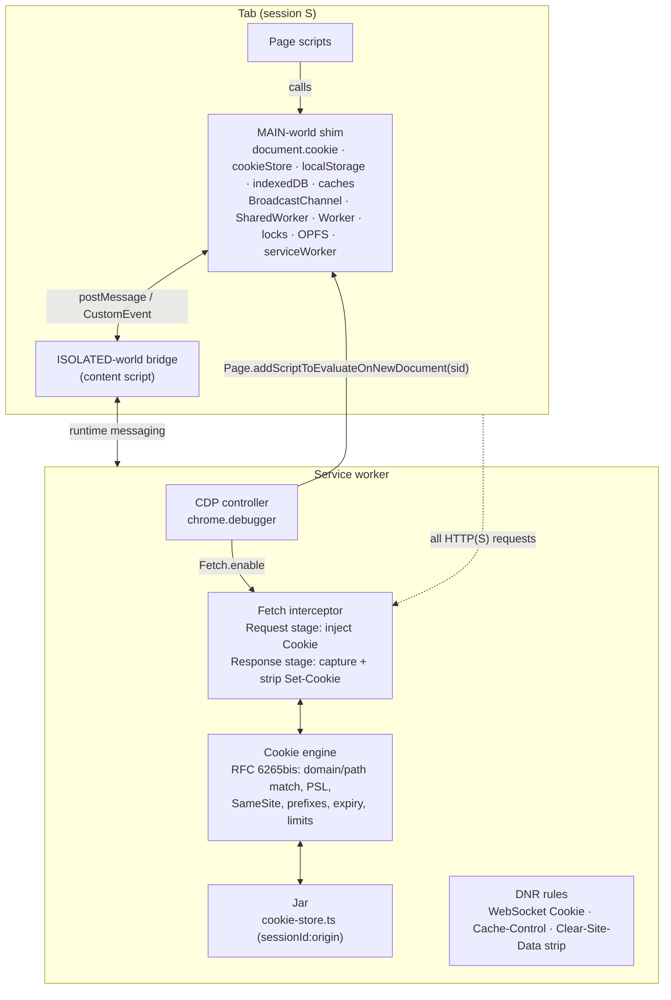
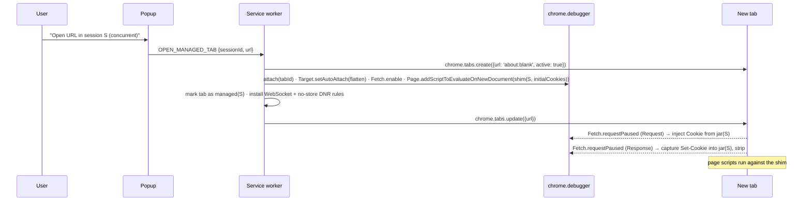

# 2 — Approach B: Profile Virtualization

**Version:** 0.1.0 (proposal)
**Status:** Fully specified — **not recommended** (see `4-Comparison-and-Decision.md`)
**Last Updated:** 2026-09-02

---

## 1. Principle

> For a managed origin, the browser's cookie jar and storage buckets are never used. The extension *is* the profile: it owns the cookies, decides which ones every request carries, virtualizes every storage API the page can reach, and keeps the browser's own structures permanently empty so nothing can leak between tabs.

Tabs stay real tabs. Isolation is achieved by interposing at two places: the network (every request and response of the tab) and the page's JavaScript globals (every storage and cookie API), both keyed by the tab's session.

This is the approach the pre-MV3 generation of multi-session extensions took. Everything below is what it takes to do it correctly under MV3 — and where "correctly" stops being reachable.

---

## 2. Architecture



Six layers, each described below with its mechanism, its residual holes and its fail-closed rule.

---

## 3. Layer 1 — Session identity at `document_start`

**Problem.** The MAIN-world shim must know the tab's session id **synchronously, before the first page script runs**. `localStorage.getItem` is synchronous; a shim that does not yet know which prefix to use has to either return wrong data or block, and it cannot block.

| Option | Why it fails / works |
|---|---|
| `chrome.scripting.registerContentScripts({ world: 'MAIN' })` with the id in the code | Registration is global, not per tab. One script for all tabs cannot carry a per-tab value. 📘 |
| ISOLATED content script reads the id, hands it to MAIN | Content scripts have no synchronous storage API (`chrome.storage.*` and messaging are async). The hand-off arrives after page scripts may have run. 📘 |
| `chrome.scripting.executeScript({ injectImmediately: true })` on `webNavigation.onCommitted` | Best effort only — documented as "not a guarantee that injection will occur prior to page load". 📘 |
| Encode the id in the URL (`#`/query) | Pollutes the page's URL, visible to the page, breaks on redirects. |
| Real `sessionStorage` marker written by the extension (per tab, per origin, survives same-origin navigations) | Works from the *second* document of an origin in the tab onwards; the *first* document has no marker. |
| **`chrome.debugger` → `Page.addScriptToEvaluateOnNewDocument(source)` with the id baked into `source`** | Runs in every new document of the target before any page script, deterministically. 📘 **The only exact option.** |

**Consequence.** B requires `chrome.debugger` for correctness before a single cookie is involved. Out-of-process iframes are separate targets: `Target.setAutoAttach({ autoAttach: true, waitForDebuggerOnStart: true, flatten: true })` on the tab session, and the same `addScriptToEvaluateOnNewDocument` on every auto-attached frame target, then `Runtime.runIfWaitingForDebugger`. 📘

**Fail-closed rule.** If `chrome.debugger.attach` fails (enterprise policy, another incompatible client, `chrome://` page) or `onDetach` fires (user pressed *Cancel* on the infobar, DevTools conflict), the tab must be navigated to an extension-owned blocking page immediately. A managed tab without an attached debugger is a tab running in the default identity with the session badge on it — the worst possible outcome.

---

## 4. Layer 2 — Cookies

### 4.1 Network side: `Fetch` interception

Enable on the tab target and every auto-attached frame target:

```
Fetch.enable({ patterns: [
  { urlPattern: '*', requestStage: 'Request'  },
  { urlPattern: '*', requestStage: 'Response' },
]})
```

**Request stage** (`Fetch.requestPaused` without `responseStatusCode`):

1. Resolve the tab's session `S` and the request URL `u`.
2. Drop any browser-supplied `Cookie` header (the browser jar is kept empty for managed origins; this is defense in depth).
3. Compute the cookie set from the jar: every cookie in `S`'s snapshots whose domain matches `u.host`, path matches `u.path`, `Secure` is satisfied by `u.scheme`, not expired, and **SameSite permits** the request (see 4.3).
4. `Fetch.continueRequest({ requestId, headers: [...original minus Cookie, { name: 'Cookie', value }] })`.

**Response stage** (`Fetch.requestPaused` with `responseStatusCode`):

1. Extract all `Set-Cookie` values from `responseHeaders`.
2. Run the cookie-setting algorithm (4.3) against the request URL; upsert/delete in the jar under `S`.
3. `Fetch.continueResponse({ requestId, responseHeaders: responseHeaders minus Set-Cookie })` so the browser's own jar never learns the cookie. 📘 (`Fetch.continueResponse` accepts `responseHeaders`; verify on the minimum supported Chrome.)
4. Also strip `Clear-Site-Data` here — in the browser it would wipe the origin's *shared* buckets, i.e. every session's prefixed data at once (see 5.3).

**Why this and not `webRequest` + DNR.** The standard login flow is `POST /login` → `302` + `Set-Cookie` → `GET /home`. The browser follows the redirect *inside the same network job*; an observer sees the `302` headers asynchronously, and a DNR session-rule update is an async IPC. The `GET /home` has left before the rule exists, carries no session cookie, and the server bounces to the login page. Deterministically, on every login. Only a mechanism that **pauses** the redirect hop until the jar is updated is correct — and only `Fetch` pauses. This is the single most important reason B cannot be built on `webRequest`.

**Redirect chains** therefore work naturally: hop *n*'s Response stage updates the jar before hop *n+1*'s Request stage is continued.

### 4.2 Requests `Fetch` does not see

| Source | Behaviour | Handling |
|---|---|---|
| WebSocket handshakes | Not interceptable by `Fetch` (🧪 verify on target Chrome). | Tab-scoped DNR `Cookie: set` rule for `resourceTypes: ['websocket']` regenerated on every jar change. Async → inherently racy; acceptable because handshakes are rare and retried by apps. |
| Service-worker-initiated fetches | Not part of the tab target. Auto-attach can reach the SW target, but one SW serves *every* tab of the origin — there is no session to attribute the request to. | **Block service workers** for managed origins (Layer 4). |
| Prefetch / preconnect / speculation rules | Browser-initiated, may run before attach. | `Network.setCacheDisabled(true)` + strip `Link: rel=prefetch/preload` response headers; disable speculation rules via `Content-Security-Policy` injection is not possible → accept as a small cache leak vector unless cache is fully disabled. |
| Requests before `Fetch.enable` completes on a fresh document | Race between navigation commit and enable. | Attach with `waitForDebuggerOnStart` on auto-attached targets; for the tab target, open managed tabs *from the extension* (attach → enable → then navigate). Never adopt an already-loaded tab. |
| Extension-initiated requests (`fetch` from the SW) | Not from the tab. | N/A. |

### 4.3 The cookie engine we would have to write

The browser's cookie store is being replaced, so its rules must be re-implemented exactly, or sites break in subtle ways:

- Host-only vs domain cookies; domain-match; **public suffix list** (a `Domain=.co.uk` cookie must be rejected — needs a bundled PSL and a way to update it).
- Default-path algorithm (RFC 6265 §5.1.4), path-match.
- `Secure` (set-from-insecure restrictions, "Secure cookies cannot be overwritten from insecure origins" — Leave Secure Cookies Alone).
- `HttpOnly` (invisible to `document.cookie`/`cookieStore`; may not be set or overwritten from JS).
- `SameSite`: `Strict`, `Lax`, `None` (+ `Secure` required), the *Lax-by-default* fallback, the *Lax-allowing-unsafe* 2-minute window for fresh cookies, and the distinction between top-level navigations and subresource requests. Requires knowing the **site for cookies** of each request, i.e. tracking each frame's document origin and each request's initiator — `Fetch.requestPaused` gives `frameId` and `resourceType`, not the initiator; frame origins must be tracked from `Page.frameNavigated`.
- `__Host-` / `__Secure-` prefix rules.
- Size (4096 bytes name+value) and per-domain count limits with eviction order.
- Expiry: `Expires`, `Max-Age` (precedence), clock skew, session cookies.
- `Partitioned` attribute (CHIPS) — accept and key by top-level site to mirror Chrome.
- `Priority` (Chrome-specific eviction).

Estimate: ~1.5k lines with tests, plus a maintenance commitment that tracks Chrome's cookie behaviour changes.

### 4.4 DOM side: `document.cookie` and `cookieStore`

The MAIN shim replaces the `Document.prototype.cookie` accessor and `window.cookieStore`:

- **Getter** must be synchronous → the shim keeps an **in-page mirror** of the non-`HttpOnly` cookies for the document's URL, seeded by the `addScriptToEvaluateOnNewDocument` payload (which can embed the initial cookie set) and updated by messages from the SW whenever the jar changes (`Runtime.evaluate` or via the ISOLATED bridge).
- **Setter** parses the string, applies the setting rules (4.3, JS-restricted subset: no `HttpOnly`, prefix rules, size), updates the mirror synchronously, and notifies the SW.
- `cookieStore.get/getAll/set/delete` and the `change` event are implemented on the same mirror.

**The JS-set → request race.** `document.cookie = 'csrf=abc'; fetch('/api', …)` is a common sequence. The fetch is paused in the SW at Request stage; the cookie update travels page → ISOLATED → SW as a runtime message. There is no ordering guarantee between the CDP event and the runtime message. Mitigations, in order of preference:

1. The shim wraps `fetch`, `XMLHttpRequest.prototype.send`, `navigator.sendBeacon`, `HTMLFormElement.prototype.submit` and form submission events to *first* flush pending cookie writes over a synchronous channel — there is none; the best available is `Runtime.bindingCalled` (`Runtime.addBinding`), which is a CDP event, ordered with other CDP events from the same renderer. This makes the update arrive **before** the `Fetch.requestPaused` for the subsequent request on the same target. 📘 Plausible; verify ordering guarantees.
2. Failing that, the shim attaches a `X-US-Cookie-Delta` request header carrying the pending writes, which the interceptor consumes and strips. Hacky but deterministic.

### 4.5 What the browser jar sees

Nothing, for managed origins: `Set-Cookie` is stripped at Response stage and `Cookie` is overwritten at Request stage. Cookies of **unmanaged** origins (an origin the session has no data for) follow today's soft-mode logic: pass through untouched, or, in strict mode, are treated as managed with an empty jar.

---

## 5. Layer 3 — DOM storage virtualization

All in the MAIN shim, installed before any page script. Every API is redirected into a **per-session namespace** inside the origin's real, shared bucket.

### 5.1 Per-surface mechanism

| Surface | Mechanism | Notes and holes |
|---|---|---|
| `localStorage` | `Proxy` over the real `Storage` object: `getItem/setItem/removeItem/key(i)/length/clear` and property-style access (`get/set/deleteProperty/has/ownKeys/getOwnPropertyDescriptor` traps) map `k` ↔ `us:<sid>:k`. `Object.defineProperty(Window.prototype, 'localStorage', …)` replacing the accessor with an identical descriptor shape. | **Quota is shared**: Chrome's ~10 MB per-origin limit now covers *all* sessions' namespaces; session A can fill it and break session B — a cross-session denial the real browser does not have. `key(i)`/`length` become O(n) filters. |
| `sessionStorage` | Leave native — already per tab. | — |
| `storage` events | Native events carry the prefixed key and fire for all namespaces. Intercept `addEventListener('storage')` and `onstorage`, re-dispatch a synthetic `StorageEvent` with the unprefixed key only for the current namespace. | Events from other sessions' namespaces must be swallowed. |
| IndexedDB | `IDBFactory.prototype.open/deleteDatabase(name)` → `<prefix>name`; `databases()` filters and strips; `IDBDatabase.prototype.name` getter strips. | Clean: real per-name isolation with native transactions. Would make today's `content/idb-swap.ts` copy-restore unnecessary in B. Quota shared (same as above). |
| Cache Storage | `CacheStorage.prototype.open/has/delete/keys/match` → prefixed cache names. | `match()` across caches must be restricted to the namespace. |
| `BroadcastChannel` | Constructor wrapper prefixes the channel name. | — |
| `SharedWorker` | Constructor wrapper prefixes `options.name` (identity = origin + URL + name). | The worker script itself runs **outside the shim** (see Workers). |
| Web Locks | `navigator.locks.request/query` prefix lock names. | — |
| OPFS | `navigator.storage.getDirectory()` → `root.getDirectoryHandle(prefix, {create:true})`. | `estimate()` shared. |
| `window.name`, `history.state` | Per tab. | — |
| `Clear-Site-Data` response header | Stripped at the network layer (4.1). | Otherwise wipes every session's namespace at once. |
| Dedicated `Worker` / module workers | **The shim does not run inside workers.** A worker's `indexedDB`, `caches`, `locks`, `navigator.storage` are the real, unprefixed ones. | Wrap the `Worker` constructor to load a bootstrap (blob/data URL) that installs the shim and then `importScripts(realUrl)`; module workers need `import()` of the real URL from the bootstrap; relative URL resolution and `worker-src` CSP break it on real sites. **Residual hole.** |
| WebSQL | Removed from Chrome. | — |
| Cookie Store API in workers | Same as workers above. | Residual hole. |

### 5.2 Fidelity constraints of the shim

- Replaced accessors/functions must live on the **prototype** with native-looking descriptors, and `Function.prototype.toString` must be patched to return `function localStorage() { [native code] }` for wrapped functions, or the shim is trivially detectable (see Layer 6).
- Everything the shim needs (`Reflect`, `Proxy`, the original functions) must be captured at install time; pages may later monkey-patch globals.
- The shim runs in *every* frame of the tab, including third-party iframes (their origins are separate buckets, but a third-party frame of the same managed origin is in scope).
- Iframes created with `about:blank`/`srcdoc` inherit the parent's origin and must be shimmed too (`addScriptToEvaluateOnNewDocument` covers them).

### 5.3 Namespaces and the sequential model

If B ships alongside the sequential model, a normal tab (native buckets, no prefix) and a B tab (prefixed) on the same origin coexist in the same real bucket. The B namespace must be disjoint from anything a page would write, hence the `` in the prefix.

---

## 6. Layer 4 — Service workers

**Why it is not solvable, only avoidable.** A service worker is registered per (origin, scope) and serves *every* client of that origin in the profile. Its fetches have no tab (`tabId === -1` in `webRequest`; DNR's `tabIds` cannot match them). Even if the SW target is attached over CDP, a request from it belongs to *all* sessions with a tab open on the origin and to none in particular. The identity of a SW-originated request is **ontologically ambiguous** under B. Firefox containers do not have this problem because the SW registry is partitioned per container; Approach C does not have it because the registry is partitioned per credentialless nonce.

**Policy.** For managed origins in B tabs:

1. The shim rejects `navigator.serviceWorker.register()` with a descriptive `DOMException` (`SecurityError`, message names the extension) and makes `navigator.serviceWorker.ready` never resolve; `controller` is `null`.
2. On first managed load, `getRegistrations().then(rs => rs.forEach(r => r.unregister()))` for the origin.
3. Network safety net: `Fetch.failRequest` for any request carrying `Service-Worker: script` (SW script fetches) from a managed tab.

**Consequences for the user (must be documented in the product):** no offline mode, no push notifications, no background sync, no SW-based caching for managed origins; some PWAs render a degraded UI or an "unsupported browser" page.

---

## 7. Layer 5 — HTTP cache and connection state

The HTTP cache is keyed by network isolation key + URL and shared by every same-site top-level tab. A response cached in session A's tab (`GET /api/me` → user A) can be served from cache in session B's tab.

| Option | Trade-off |
|---|---|
| `Network.setCacheDisabled(true)` per managed tab | Simple, exact, heavy (every static asset refetched). |
| Inject `Cache-Control: no-store` at Response stage for `document`, `xhr`/`fetch`, `sub_frame`, `media`, `image`; leave `script`/`stylesheet`/`font` cacheable | Keeps most of the performance; assumes those three types are never personalised (true for almost all sites). Personalised images (avatars) are covered by including `image`. |
| Rely on servers' `Cache-Control: private` | Not sufficient; `private` still allows the *browser* cache. |

Recommendation for B: the selective `no-store` injection. Also strip `Link: rel=preload/prefetch` for cross-session-sensitive types, and note that TLS session resumption / HTTP/2 connection reuse across tabs is not a cookie leak and is left alone.

---

## 8. Layer 6 — Detectability and anti-fraud

The shim is observable from page JavaScript:

- `Object.getOwnPropertyDescriptor(Window.prototype, 'localStorage').get.toString()` — mitigated by patching `Function.prototype.toString`, which is itself detectable by comparing against a fresh `iframe`'s pristine `Function.prototype.toString` (the fresh iframe is shimmed too, but timing and identity checks remain).
- Prototype identity checks (`localStorage instanceof Storage`), error message and stack-trace shapes, execution timing of storage calls.
- Behavioural signals: `navigator.serviceWorker.register` throwing on an origin where it normally succeeds.

Bot-management and anti-fraud vendors used by banks, ticketing and social platforms score exactly these signals. A user of B would face more CAPTCHAs, step-up authentication and occasional hard blocks on the sites they most want to multi-account on. This is a structural property of emulation, not a bug to fix.

---

## 9. Tab lifecycle



- **Cross-origin navigation inside the tab.** The interceptor selects the jar bucket by request URL, so the session naturally spans origins: B tabs have **container semantics** (like Firefox), unlike today's `tab-tracker.ts` rule that unassigns on cross-origin navigation. This is a data-model shift shared with Approach C (see `3-Approach-C-Credentialless-Shell.md` §7).
- **Popups / `target=_blank`.** New tabs opened from a managed tab (`chrome.tabs.onCreated` with `openerTabId`) are attached and bound to the same session *before* their first request only if opened `about:blank`-first — most popups navigate immediately, so the first request can escape. Mitigation: shim `window.open` to open `about:blank`, let the SW attach, then navigate. With that, **OAuth popup flows work** and `window.opener` is intact — a genuine advantage of B over C.
- **Multiple tabs per session** share the jar through the SW — also an advantage over C.
- **Tab close.** Nothing to capture: every cookie was captured at Response stage; storage was written through to real (prefixed) buckets. Detach, remove DNR rules.
- **Service-worker restart.** `chrome.debugger` sessions belong to the extension, but whether they survive MV3 idle termination is not documented (🧪 verify). If they do not, every managed tab is unprotected between termination and re-attach → an unavoidable leak window unless the tab is frozen. Mitigation: keep the SW alive while managed tabs exist (`chrome.debugger` traffic itself may do this; `chrome.alarms` at 30 s does not guarantee it). **This is a correctness risk with no clean answer.**

---

## 10. Permissions, policy and store review

| Item | Impact |
|---|---|
| `debugger` permission | Install warning "Read and change all your data on all websites" already exists via `<all_urls>`; `debugger` adds review scrutiny and a persistent "Unaware Sessions started debugging this browser" infobar in every managed tab (dismissable only by detaching → fail-closed page). |
| `scripting` (for MAIN-world registration, optional) | No additional warning. |
| Enterprise policy `DeveloperToolsAvailability = 2` | Disables `chrome.debugger` → B is impossible on many managed workstations, precisely where multi-account use is common. |
| DevTools co-existence | Multiple CDP clients per target are supported; user-opened DevTools does not detach us, but some `Fetch` interactions between clients are order-dependent. |

---

## 11. Coverage matrix

| Surface | Isolated? | How | Residual risk |
|---|---|---|---|
| HTTP cookies (incl. `HttpOnly`) | ✅ | `Fetch` Request/Response + jar | Re-implemented cookie semantics drift from Chrome's |
| JS cookies (`document.cookie`, `cookieStore`) | ✅ | Shim + mirror | JS-set → request ordering (mitigated) |
| WebSocket handshake cookies | ⚠️ | DNR tab rule | Async rule update race |
| `localStorage` | ✅ | Prefix proxy | Shared quota; `storage` event rewriting |
| `sessionStorage` | ✅ | Native | — |
| IndexedDB | ✅ | DB rename | Shared quota; workers |
| Cache Storage | ✅ | Name prefix | Workers |
| Service workers | 🚫 blocked | Register rejected + unregister | Feature loss (offline, push) |
| Dedicated/module workers | ❌ | Bootstrap wrapper (fragile) | Unprefixed storage access from workers |
| `BroadcastChannel`, Web Locks, `SharedWorker` | ✅ | Name prefix | — |
| OPFS | ✅ | Root subdirectory | — |
| HTTP cache | ⚠️ | Selective `no-store` | Personalised assets in cacheable types |
| `Clear-Site-Data` | ✅ | Stripped | — |
| FedCM / browser-mediated identity | ❌ | Browser-level, uses the profile's IdP cookies | Cross-session identity leak on "Sign in with …" via FedCM |
| Detectability | ❌ | Best-effort masking | Anti-fraud scoring |

---

## 12. Effort and module list

| Module | Purpose | Size (est.) |
|---|---|---|
| `background/cdp-controller.ts` | attach/detach, auto-attach, script injection, fail-closed | ~600 |
| `background/fetch-interceptor.ts` | Request/Response stage handlers, redirect handling | ~500 |
| `shared/cookie-engine-rfc.ts` | RFC 6265bis + PSL + SameSite + limits | ~1.5k |
| `background/jar.ts` | Incremental jar over `cookie-store.ts`, expiry, undo semantics | ~400 |
| `content/main-shim/*` | Cookie mirror, storage proxies, IDB/Cache rename, channels, locks, OPFS, SW block, worker bootstrap, toString masking | ~2.5–4k |
| `content/bridge.ts` | ISOLATED ↔ MAIN ↔ SW messaging | ~300 |
| DNR additions | WebSocket cookie rule, no-store, `Clear-Site-Data`, `Link` strip | ~200 |
| Tests | Cookie engine (heavy), shim unit tests under jsdom, integration via CDP | large |

Order of magnitude: 6–9k lines of new code with a permanent maintenance tail tracking Chrome's cookie and storage behaviour.

---

## 13. Verdict

B **can** deliver concurrent identities in real tabs, and it has two genuine advantages over C: OAuth popup flows keep working, and several tabs of one session share state live. Everything else weighs against it:

- **Correctness is emulated, not enforced.** Workers, FedCM and every future storage API are holes until patched. The 4.3 cookie engine must track Chrome forever.
- **`chrome.debugger` is load-bearing twice** (identity injection and redirect-safe cookie handling), bringing the infobar, enterprise-policy exposure and store-review risk with it.
- **Service workers must be disabled** on managed origins, degrading exactly the large web apps users multi-account on.
- **Shared quota and detectability** are structural, not fixable.
- **SW-restart exposure** may leave a leak window that cannot be closed from an extension.

Approach B is therefore fully specified here so it does not have to be re-derived, and **not recommended**. See `4-Comparison-and-Decision.md`.
