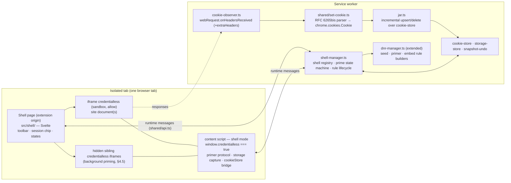
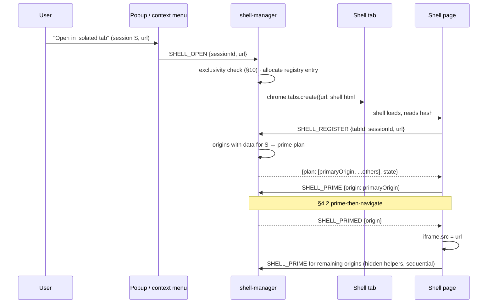
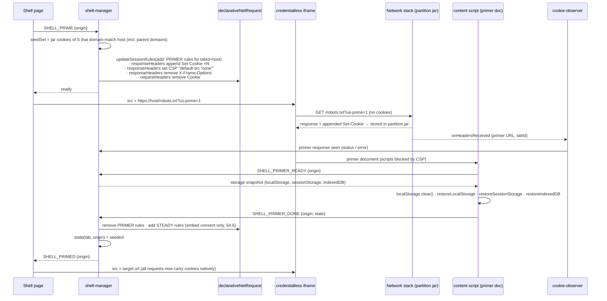
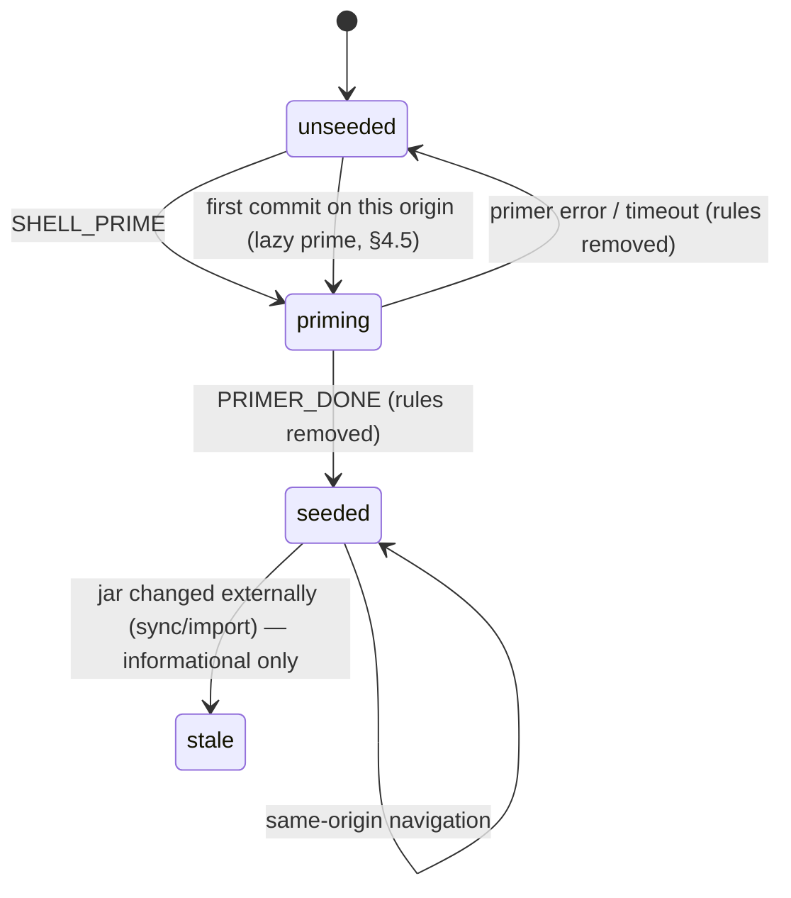

# 3 — Approach C: Credentialless Shell ("Isolated Tabs")

**Version:** 0.1.0 (proposal)
**Status:** **Recommended path** — pending spike (`5-Spike-Plan.md`)
**Last Updated:** 2026-09-02

---

## 1. Principle

> Let Chromium do the isolation. The extension does persistence and UX.

An extension page — the **shell** — hosts the site inside an `<iframe credentialless>`. Chromium gives that frame a brand-new, nonce-keyed partition: its own cookie jar, its own `localStorage`/IndexedDB/Cache Storage, its own service-worker registry, its own network partition. Two shells on the same origin are two partitions. Nothing in the page can see, bypass or break that, because it is not implemented in the page.

The partition is **ephemeral** — it lives exactly as long as the shell document. Persistence is therefore the extension's job, and it is a job the extension already does: the session snapshot stores become the durable **jar**, the content-script swap becomes the storage restore, and a new header observer becomes the cookie capture.

The user-facing feature is a new tab kind, **isolated tab**, opened from the popup or the context menu. Normal tabs and the sequential model keep working unchanged.

---

## 2. What `<iframe credentialless>` provides

| Property | Status |
|---|---|
| Shipped in Chrome 110 (Feb 2023); Edge/Brave/Opera follow Chromium. | 📘 |
| The frame gets a **new, empty, ephemeral cookie jar**: no cookie from the profile's jar is sent; cookies the site sets are stored in the partition and sent on subsequent requests from the partition. | 📘 |
| The frame gets **new, empty, ephemeral storage** (`localStorage`, `sessionStorage`, IndexedDB, Cache Storage, OPFS) and its own **service-worker registry**. | 📘 |
| The partition is keyed by a **nonce bound to the top-level document**. Navigating or reloading the shell creates a new nonce (new partition). Credentialless iframes *in the same* top-level document share the nonce. | 📘 for the lifetime; 🧪 **H3** for sibling sharing (load-bearing for §4.5 background priming) |
| The network partition (HTTP cache, socket pools) includes the nonce → no cross-shell cache hits. | 🧪 **H7** (fallback: `Cache-Control: no-store` via DNR) |
| `window.credentialless === true` inside the frame — a **synchronous** signal usable by content scripts at `document_start`. | 📘, 🧪 **H4** for visibility in the ISOLATED world |
| Popups opened from the frame are **non-credentialless** and opened with `noopener`. | 📘 → OAuth-popup limitation, §4.7 |
| `X-Frame-Options` and CSP `frame-ancestors` are still enforced against the embedder (the extension origin). | 📘 → §4.6 |
| Permission-gated features inside the frame are restricted / delegated. | 🧪 **H8** (informational) |
| `chrome.cookies` **cannot** read or write a nonce-partitioned jar. | 🧪 **H5** (expected; the design assumes it) |
| Content scripts inject into the frame like into any subframe (`all_frames: true`). | 🧪 **H4** |

The consequence of "ephemeral": **capture must be continuous**, not on-close. When the shell closes there is nothing left to read. Cookies are captured as they are set (§4.4); storage is captured on a cadence (§4.4.3). This is stronger than today's model, where a login completed after the last auto-save is lost if the browser crashes.

---

## 3. Architecture



Responsibilities:

| Component | Owns |
|---|---|
| **Shell page** | Layout, toolbar, URL/title display, loading/priming/blocked states, hash routing (`#sid=…&url=…`), the iframe element(s), keyboard shortcuts. Never touches cookies or storage itself. |
| **`shell-manager.ts`** | Registry of shell tabs (`tabId → ShellTabState`), persisted to `chrome.storage.session`; the per-(tab, origin) prime state machine; installing/removing DNR rules at the right moments; answering popup/options queries; exclusivity rules; popup re-routing. |
| **`cookie-observer.ts`** | One top-level `chrome.webRequest.onHeadersReceived` listener, `['responseHeaders','extraHeaders']`, `<all_urls>`; early-returns unless `details.tabId` is a shell tab; forwards `Set-Cookie` lines + request URL to the jar writer. Also detects framing-hostile responses (§4.6) and primer completion (§4.2). |
| **`shared/set-cookie.ts`** | Pure parser: one `Set-Cookie` line + request URL → a `chrome.cookies.Cookie`-shaped record or a deletion. Unit-tested exhaustively. |
| **`jar.ts`** | Incremental updates to `cookie-store.ts` snapshots (`sessionId:origin`), expiry pruning, deletion, undo-buffer semantics, and the **seed set** computation for a host. |
| **Content script (shell mode)** | On `window.credentialless === true`: primer protocol (restore storage, ack), URL/title reporting, storage capture cadence, `cookieStore` change bridge for JS-set cookies. In normal top-level tabs: today's behaviour, unchanged. |
| **DNR builders** | Three rule sets with fixed slots per shell tab (§6). |

---

## 4. Lifecycle and flows

### 4.1 Opening an isolated tab



If the session has **no data for any origin**, there is nothing to prime: the shell navigates immediately and the fresh partition is a fresh identity — equivalent to strict isolation today.

### 4.2 Bootstrap: prime-then-navigate

The problem to solve: a fresh partition is empty, the jar holds the identity, and the identity must be in the *browser's* jar (not injected per request) so that the browser handles redirects, rotations, `document.cookie` and `HttpOnly` correctly and synchronously (§5 explains why injection cannot do this).

The only ways a partition's jar learns a cookie are a **`Set-Cookie` response header** received inside the partition, or **`document.cookie`** executed inside the partition. The bootstrap uses the first for every cookie (including `HttpOnly`) by having the frame make one cheap request to the origin and **appending `Set-Cookie` headers to its response** with a tab-scoped DNR rule.



Details that make this deterministic:

- **Primer URL.** `https://<host>/robots.txt?us-prime=1`. Cheap, universally routable, never an app route; the query marker lets DNR (`urlFilter: "us-prime=1"`) and the observer identify the primer request without knowing the frame id. Any response works — `200`, `404`, a redirect, an SPA catch-all — because cookies in the response are processed by the network stack regardless of status, and the primer CSP stops any page script from running.
- **Primer CSP.** `Content-Security-Policy: default-src 'none'` (`set`, replacing the server's) blocks page scripts, subresources and frames in the primer document. Extension content scripts are exempt from page CSP, so the storage restore runs. The server's `X-Frame-Options` is removed for the primer only, so the primer always renders — no embedding consent is needed for priming.
- **Seed serialization.** Each jar cookie becomes one appended header: `name=value; Path=…; [Domain=…;] [Expires=<HTTP-date>;] [Secure;] [HttpOnly;] [SameSite=…]`. Host-only cookies omit `Domain`. Expired cookies are skipped. Appended headers come **after** the server's own `Set-Cookie` lines, so for a name collision (a fresh anonymous `sessionid` from the server) the seeded value wins.
- **Seed set.** All cookies of session S, across all its `sessionId:origin` snapshots, whose domain matches `host` (host-only for `host`, domain cookies for `host` and its parents). This mirrors `getCookiesForOrigin`'s hierarchy walk over the jar instead of the live store, and means priming `mail.google.com` also installs `.google.com` cookies that `accounts.google.com` will use later.
- **Storage restore in the primer.** The primer document is a real document of the origin inside the partition; the content script writes `localStorage` and IndexedDB for the origin there, before the real page exists. `sessionStorage` is per browsing context and the *same iframe* then navigates to the target URL, so sessionStorage written in the primer is visible to the target document (🧪 **H10**). Result: the real page's first script sees fully restored storage — **deterministic**, an improvement over today's post-load restore race (`2-Product-Specifications.md` §9 "Content script race condition").
- **Failure handling.** `onErrorOccurred` for the primer (offline, DNS) → proceed to navigate anyway (the site shows its own error); state stays `unseeded` and a later successful prime is attempted on the next same-origin commit. Content script never reporting (`chrome-error://` page, H4 false) → time out after 3 s, proceed, log at `warn`. **The frame is never navigated to the target while primer rules are still installed** — the state machine guarantees rules are torn down first, so the real page never receives the primer CSP.
- **No request-side rules in steady state.** After priming, the extension does not touch request headers at all. The partition jar is the live truth.

State machine per (shell tab, origin):



### 4.3 Steady state

Every request from the frame carries the partition jar's cookies, set by Chromium. Redirect chains, cookie rotation, `HttpOnly`, `SameSite`, `Secure`, prefixes, limits — all native. There is nothing for the extension to get wrong at request time.

### 4.4 Capture

#### 4.4.1 HTTP cookies — the observer

```
chrome.webRequest.onHeadersReceived.addListener(
  onHeaders, { urls: ['<all_urls>'] }, ['responseHeaders', 'extraHeaders']);
```

- Registered **synchronously at SW top level** — an asynchronously added listener would not wake a terminated MV3 worker, and a missed `Set-Cookie` is unrecoverable (there is no jar to re-read). Early-return for `details.tabId` not in the shell registry keeps the cost bounded (🧪 **H9** measures it).
- For each `Set-Cookie` line: `parseSetCookie(line, details.url)` → upsert or delete in the jar bucket **`S:origin(details.url)`**. Bucketing by *request* origin (not cookie domain) mirrors how today's snapshots are organised — a `.example.com` cookie observed on `app.example.com` lands in the `app.example.com` bucket; the seed-set computation reunites it with `api.example.com` on prime.
- Deletions: `Max-Age<=0` or past `Expires` → remove by (name, domain, path). Expiry pruning on read.
- A `Set-Cookie` the browser *rejects* (e.g. `Secure` over `http`, invalid domain) is still recorded; on the next prime it is appended and rejected again — harmless.
- Undo semantics: today's rule "a capture that empties a non-empty snapshot is buffered, not applied blindly" (`snapshot-undo.ts`) applies unchanged when the last cookie of a bucket is deleted.

#### 4.4.2 JavaScript cookies

`document.cookie = …` never produces a response header. The content script subscribes to `cookieStore.addEventListener('change', …)` inside the frame — the event fires for changes visible to the document (all non-`HttpOnly` cookies, whatever set them) — and forwards `changed`/`deleted` lists to the jar writer. `HttpOnly` cookies cannot be set from JS, so the observer and this bridge together see every cookie the partition holds.

#### 4.4.3 DOM storage

Reuses `content/storage-swap.ts` / `content/idb-swap.ts` capture (`SAVE_STORAGE`), triggered from the shell-mode content script on:

- `visibilitychange` → hidden, `pagehide` (best-effort, `sendMessage` is usually delivered);
- a periodic timer while the frame is visible (default 10 s, coalesced, skipped when nothing changed — a cheap `localStorage` length/hash check; IndexedDB uses the existing size/time bounds);
- the existing auto-save alarm and the popup's "Save now".

Residual window: storage written in the last interval before the browser is killed. Cookies have **no** window (captured at response time). Optional later phase: a MAIN-world *write notifier* on `Storage.prototype.setItem` that only signals "changed" (no virtualization) to make capture event-driven.

### 4.5 Navigation inside the frame

The frame navigates freely; the partition follows it. This gives isolated tabs **container semantics**: session S spans every origin visited in the frame, unlike today's per-origin tab binding (`tab-tracker.ts` unassigns on cross-origin navigation).

| Case | Behaviour |
|---|---|
| Same origin | Nothing to do. Observer keeps capturing. |
| New origin, session **has data**, already primed in background | Cookies and storage are present; loads logged in. |
| New origin, session has data, **not yet primed** | First request goes out anonymous. `shell-manager` sees the commit on an unseeded origin-with-data → primes it in a hidden helper (shared nonce, 🧪 H3) → **one** automatic reload of the frame (guarded per (tab, origin) so a broken site cannot loop). |
| New origin, session has no data | Fresh identity, correct by definition. Whatever the site sets is captured into `S:origin`. |

**Background priming.** After the primary origin is primed, the shell primes every other origin with data for S, sequentially, in hidden sibling `<iframe credentialless>` elements (each removed after its `SHELL_PRIMED`). The primer request is a `robots.txt` per origin — cheap. A large session (dozens of origins) finishes in a few seconds and never blocks the visible frame. If H3 fails, only the lazy path exists and every first visit to a new origin costs one reload.

**URL and title tracking.** The frame is cross-origin; the shell cannot read `iframe.contentWindow.location`. Authoritative URL: `chrome.webNavigation.onCommitted`/`onHistoryStateUpdated` for `frameId !== 0` in shell tabs (new `webNavigation` permission, §13). Title and favicon: content-script report on `DOMContentLoaded` and `<title>` mutations. Without `webNavigation`, the content-script report is used alone (loses error pages and PDFs).

### 4.6 Framing-hostile sites

Sites that send `X-Frame-Options: DENY/SAMEORIGIN` or CSP `frame-ancestors` refuse to render inside the shell. Removing those headers is the only way to embed them, and doing so removes the site's own clickjacking protection *inside the shell*. The design therefore makes it **explicit and per site**, never silent:

1. The observer sees such a header on a `sub_frame` response in a shell tab (or `webNavigation.onCommitted` shows `chrome-error://chromewebdata/` for the frame).
2. `shell-manager` notifies the shell; the shell renders a blocked-state card: *"example.com refuses to be embedded. Allow Unaware Sessions to remove its framing protection in isolated tabs? This applies only inside isolated tabs and can be revoked in Settings."*
3. On consent the site is added to `embedAllowlist` (settings), the EMBED rules (§6) are installed for this and every shell tab, and the frame reloads.

Rule mechanics: `X-Frame-Options` → `remove`. `Content-Security-Policy` cannot be edited surgically by DNR (whole header only). Two options, chosen at implementation time: (a) `remove` the CSP header entirely for consented sites — simple, removes the site's XSS mitigations inside the shell as well; (b) Chrome 128+ `condition.responseHeaders` matching to remove CSP **only when it contains `frame-ancestors`** (🧪 verify that the condition combines with `modifyHeaders`). Either way the consent copy states what is removed. Google account pages are the canonical case (🧪 **H6**).

Framebusting scripts (`top.location = …`) are blocked by the iframe `sandbox` without `allow-top-navigation` (§9).

### 4.7 Popups and new tabs

A `window.open` / `target=_blank` from a credentialless frame opens a **normal** tab with `noopener`, outside the partition. Policy:

- `shell-manager` listens to `chrome.tabs.onCreated`; if `openerTabId` is a shell tab, it **re-routes**: closes the new tab and opens a **new isolated tab of the same session** at `pendingUrl`. That shell primes from the jar — and because capture is continuous, the jar already holds the login the user just performed in the first shell. Ordinary "open in new tab" links therefore stay inside the session.
- **OAuth / SSO popup flows break**: the popup has no `window.opener` to post the result back to, and it runs in a different partition. Redirect-based flows (the majority) work. Mitigation for popup-only sites: establish the login in a **normal** tab with the sequential model — the snapshot lands in the same jar — then open the session in an isolated tab. Documented as a known limitation (§12).
- `allow-popups` is kept in the sandbox so `target=_blank` works at all; `allow-popups-to-escape-sandbox` is required so the re-routed tab is not sandboxed.

### 4.8 Reload, restart, SW restart

| Event | Behaviour |
|---|---|
| Shell reload (F5, "Reload isolated tab") | New nonce → new partition. Hash carries `sid` + last URL; the shell re-registers and re-primes from the jar. Identity restored from the jar, which is current to the last response. |
| Browser restart with shell tabs restored | Same as reload. |
| Service-worker idle termination | Observer is a top-level listener → wakes the SW. Shell registry is in `chrome.storage.session` → rehydrated with the same ensure-hydrated pattern as `tab-tracker.ts`. No isolation gap: isolation is the partition's, not the SW's. |
| Jar updated while a shell is open (sync, import, edit in options) | The open partition is authoritative for its lifetime; the change applies on the next shell open. Shown as an informational "stale" state, never auto-applied (it would fight the live site). |
| Shell tab closed | Registry entry removed, all its DNR rules removed (`cleanupStaleRules` already sweeps rules of dead tabs), pending helpers cancelled. Nothing to capture. |

---

## 5. Why prime-then-navigate, not per-request header injection

Today's `dnr-manager.ts` **sets** the `Cookie` header per tab. Continuing that in the shell would put two sources of truth in play — the partition jar (live, synchronous) and the injected header (from the extension jar, asynchronously refreshed) — and every combination fails:

| Strategy | Failure |
|---|---|
| `set Cookie` from jar, refresh rule when the observer sees `Set-Cookie` | `set` replaces the whole header. Any cookie the server rotates is clobbered with the stale value until the async rule update lands; on a `302` login redirect the follow-up hop leaves before the update → **login breaks deterministically**. |
| `append Cookie` from jar | Duplicate names once the partition jar has the cookie too. Servers disagree on first-vs-last-wins → nondeterministic across backends. |
| Strip all `Set-Cookie`, own the jar completely (B's inbound layer) | Same `302` race, now for *every* cookie; only `chrome.debugger`/`Fetch` pausing fixes it → drags B's costs into C. |
| `document.cookie` seeding from the content script | `HttpOnly` cookies cannot be set from JS — and they are the session cookies. |
| **Seed the partition jar once via appended `Set-Cookie`, then step aside** | One legitimate response-header path; the browser owns everything afterwards. **No dual source, no race.** Load-bearing assumption: 🧪 **H1**. |

Why H1 is expected to hold: DNR `modifyHeaders` rules are applied through the network service's trusted header client — the same path MV2 `webRequestBlocking` used, where modified `Set-Cookie` headers *were* honoured by the cookie store — and cookie-blocking extensions rely on DNR `remove Set-Cookie` preventing storage today. Appending is the symmetric operation. It is still verified first because the entire bootstrap rests on it.

If H1 fails: fallback F1 — `chrome.debugger` on shell tabs, `Fetch` Request-stage **merge** (add jar cookies the request lacks; never override what the partition sends). Exact and race-free, at the cost of the debugger infobar for isolated tabs only. The rest of C is unchanged.

---

## 6. DNR rule catalog

Today: one rule per tab, id `DNR_RULE_ID_BASE + tabId` (`dnr-manager.ts` `buildRuleId`). Shell tabs need a handful of rules with distinct purposes, all **session-scoped** and **`tabIds`-scoped**, allocated as `SHELL_RULE_ID_BASE + tabId * 8 + slot` (≤ 8 slots, `SHELL_RULE_ID_BASE` well above the legacy range). One primer at a time per tab, so primer slots are reused across origins.

| Slot | Name | Condition | Action | Lifetime |
|---|---|---|---|---|
| 0 | `PRIMER_SEED` | `tabIds:[t]`, `requestDomains:[host]`, `resourceTypes:['sub_frame']`, `urlFilter:'us-prime=1'` | `responseHeaders`: `append Set-Cookie` × N | prime only |
| 1 | `PRIMER_DOC` | same | `responseHeaders`: `set Content-Security-Policy: default-src 'none'`, `remove X-Frame-Options`; `requestHeaders`: `remove Cookie` | prime only |
| 2 | `EMBED_XFO` | `tabIds:[t]`, `requestDomains:[allowlisted…]`, `resourceTypes:['sub_frame']` | `responseHeaders`: `remove X-Frame-Options` | while tab open, if any consented site |
| 3 | `EMBED_CSP` | as 2 (+ `responseHeaders` value condition if available) | `responseHeaders`: `remove Content-Security-Policy` | as 2 |
| 4 | `CACHE_GUARD` | `tabIds:[t]` | `responseHeaders`: `set Cache-Control: no-store` for non-static types | **only if H7 fails** |
| 5–7 | reserved | | | |

Rule counts: ≤ 5 per shell tab; 20 shells ≈ 100 rules against the 5,000 session-rule limit (`DNR_RULE_LIMIT`). Sweep on tab close and in the existing `cleanupStaleRules` alarm.

Header value limits: `Set-Cookie` values up to ~4 KiB each; DNR accepts arbitrary strings. Cookies exceeding Chrome's own limit would have been rejected by the browser originally and never observed.

---

## 7. Data model

### 7.1 Types (`shared/types.ts`)

```ts
export type TabMode = 'native' | 'shell';

export interface TabSessionEntry {
  sessionId: string;
  origin: string;           // native: tab origin · shell: current frame origin
  storeId?: string;         // native only
  mode?: TabMode;           // undefined === 'native' (backward compatible)
}

export type PrimeState = 'unseeded' | 'priming' | 'seeded';

export interface ShellTabState {
  tabId: number;
  sessionId: string;
  currentUrl: string;       // authoritative (webNavigation) or reported
  title?: string;
  favicon?: string;
  origins: Record<string, PrimeState>;   // per origin with data
  reloadedOnce: string[];   // origins that already got the one-time lazy reload
  blockedOrigin?: string;   // awaiting embedding consent
}
```

Snapshot formats are **unchanged**: cookies observed in a partition are stored as `chrome.cookies.Cookie` records (`storeId: 'shell'` sentinel; `restoreCookies` already passes an explicit store id and must ignore the record's). Sync, export/import, tombstones and the undo buffer need no changes.

### 7.2 Settings (`ExtensionSettings`)

```ts
embedAllowlist: string[];          // sites the user consented to un-frame (eTLD+1)
isolatedTabPopups: 'reroute' | 'leave';   // §4.7, default 'reroute'
```

### 7.3 Storage keys

`STORAGE_KEYS.SHELL_TABS` (`chrome.storage.session`) — the shell registry. `STORAGE_KEYS.TAB_MAP` keeps carrying shell tabs too (with `mode: 'shell'`) so the badge, popup counts and `getTabsForSession` work without special cases.

### 7.4 Container semantics and the popup

The popup groups sessions by the *current tab's origin* ("This site"). For a shell tab the tab's URL is the extension page; `GET_SESSION_FOR_TAB` returns the shell state (session + **frame** origin), and `CurrentTabPanel` shows the frame origin with an "Isolated" chip. Session switching in a shell tab is disabled (switch = open another isolated tab). `doSwitchSession` rejects shell tabs defensively.

---

## 8. Content script changes

Manifest: `content_scripts[0].all_frames = true`. Every frame everywhere now gets the script; the first statement decides the mode:

```ts
const inShell = window.credentialless === true;   // synchronous, document_start
if (!inShell && window !== window.top) { /* not our frame: stay inert */ return; }
```

Top-level normal tabs: unchanged behaviour. Credentialless frames: shell mode —

| Concern | Behaviour |
|---|---|
| Primer | `location.search` includes `us-prime=1` → `SHELL_PRIMER_READY {origin}` → restore payload → `localStorage.clear()`, `restoreLocalStorage`, `restoreSessionStorage`, `restoreIndexedDB` (existing functions) → `SHELL_PRIMER_DONE`. |
| Frame reporting | `SHELL_FRAME_EVENT {kind:'commit'|'title'|'favicon', url, title}` on `document_start`, `DOMContentLoaded`, `<title>` mutations, `popstate`. |
| Storage capture | `SAVE_STORAGE` payload on the cadence in §4.4.3, tagged with origin. |
| JS cookies | `cookieStore.onchange` → `SHELL_COOKIE_CHANGE {changed[], deleted[], url}`. |
| Existing `RESTORE_STORAGE`/`SAVE_STORAGE` handlers | Kept; used by the primer and capture paths. |

No MAIN-world code is required for C's core.

---

## 9. Shell UI specification

`src/shell/index.html`, `src/shell/App.svelte` (+ components), Svelte 5 runes, `shared/theme.css` tokens, light/dark.

**Layout.** A 40 px toolbar and the frame filling the rest.

| Control | Behaviour |
|---|---|
| Back / Forward / Reload | `history.back()/forward()` on the shell operate the joint session history (includes frame navigations); Reload = `iframe.contentWindow.location.reload()` is cross-origin-blocked → re-assign `iframe.src` to the current URL (loses in-frame history position; acceptable) or use `chrome.webNavigation`-tracked URL. |
| Address field | Shows the authoritative frame URL; editable; Enter → `iframe.src = url` (stays in the partition). `Cmd/Ctrl+L` via `chrome.commands` (a shell-level keydown cannot see keys while the frame has focus). |
| Session chip | Colour + emoji + name; click → popover: session details, "Open another isolated tab of this session", "Reload isolated tab (new partition)", "Open this page in a normal tab" (leaves isolation; confirm). |
| Title / favicon | From content-script reports; `document.title` of the shell mirrors it so the browser tab strip is meaningful. |
| States | *Priming* (skeleton + "Restoring session…"), *Blocked embedding* (consent card, §4.6), *Primer failed* (proceeded anyway, subtle notice), *Offline*, *Stale jar* (informational). |
| Popup re-route toast | "Opened in a new isolated tab of session S" with an *Undo → open normally* action. |

**iframe attributes.**

```html
<iframe credentialless
  sandbox="allow-scripts allow-same-origin allow-forms allow-popups
           allow-popups-to-escape-sandbox allow-modals allow-downloads
           allow-orientation-lock allow-pointer-lock allow-presentation"
  allow="clipboard-read; clipboard-write; fullscreen; publickey-credentials-get;
         publickey-credentials-create; payment; geolocation; camera; microphone"
  referrerpolicy="no-referrer-when-downgrade">
```

`allow-top-navigation*` is deliberately omitted (framebusting). `allow-same-origin` keeps the frame's real origin (required for storage and content scripts). Which `allow` features actually work in a credentialless frame is 🧪 H8.

**Accessibility.** Toolbar controls are real buttons with names; the frame has a `title`; states are announced via `aria-live="polite"`; focus moves into the frame after navigation. Shell keyboard shortcuts follow the popup's invariant (bound to `window`).

**Hash routing.** `#sid=<sessionId>&url=<encodeURIComponent(url)>`, updated on every authoritative commit — reload-safe, bookmark-safe, no storage dependency.

---

## 10. Coexistence with the sequential model

| Rule | Reason |
|---|---|
| A session that is open in an isolated tab **cannot be switched to** in a normal tab on the same origin, and vice versa (toast: "Session S is open in an isolated tab — focus it or close it"). | The sequential model's `saveCookies` **replaces** a bucket from the live profile jar; it would clobber the shell's incremental captures for the same `S:origin`. Different origins do not conflict. |
| Several isolated tabs of the **same** session are allowed. | Each is its own partition seeded from the same jar; captures merge per cookie (last writer wins). A later phase can host multiple frames in one shell (shared nonce) for live sharing. |
| Badge, tab counts, "tabs for session" include shell tabs. | `TAB_MAP` carries them with `mode: 'shell'`. |
| Isolation mode setting (`soft`/`strict`) is irrelevant in shells. | A partition is always strict by construction; the shell UI does not show the isolation chip. |
| Popup: "Open in isolated tab" on every session row (and `Shift+1–9`), context menu: "Open link in isolated tab → session". | Entry points. |

---

## 11. Security considerations

- **Isolation boundary.** Enforced by Chromium's partitioning; no page code path can cross it. The extension never injects request cookies in steady state, so there is no header-rewrite surface to get wrong.
- **Embedding consent.** Removing `X-Frame-Options`/CSP is scoped to isolated tabs (`tabIds`) and to sites the user explicitly allowed. The consent copy names the protection being removed. Revocable in Settings; the list is exported/synced with settings.
- **Extension page CSP.** Default MV3 `extension_pages` policy (`script-src 'self'; object-src 'self'`) does not restrict `frame-src`; declare `frame-src https: http:` explicitly to document intent.
- **URL display trust.** The address field shows `webNavigation`-reported URLs (browser-authoritative), not anything the page claims. Titles come from our content script, not from page messages.
- **Seeded cookies.** Serialized with their original attributes (`Secure`, `HttpOnly`, `SameSite`, `Domain`, `Path`, expiry), so the partition enforces exactly the constraints the originating server intended.
- **Primer document.** `default-src 'none'` guarantees no site code executes with storage half-restored.
- **Jar at rest.** Unchanged: extension IndexedDB, optional passcode/biometric gate, encrypted Drive sync.
- **Sandbox.** No `allow-top-navigation`; popups escape the sandbox only into tabs the extension immediately re-routes.

---

## 12. Limitations (honest list)

| Limitation | Severity | Mitigation |
|---|---|---|
| Browser-in-browser: address bar shows `chrome-extension://`, site history/bookmarks are the shell's | Product-defining | Shell toolbar; bookmarking the shell URL reopens the isolated tab with the right session and URL. |
| OAuth/SSO **popup** flows do not complete (no `opener`, different partition) | High for affected sites | Redirect flows work; log in via a normal tab first (same jar); document. |
| Multiple isolated tabs of one session do not share **live** state, only the jar | Medium | Continuous capture makes the jar near-live; multi-frame shell later. |
| Sites that refuse embedding require consent to remove their framing (and possibly CSP) protection inside the shell | Medium | Explicit per-site consent; scoped to isolated tabs. |
| Storage capture has a bounded window (interval), cookies do not | Low | 10 s cadence + lifecycle events; optional write-notifier. |
| Permission-gated features (camera, notifications, WebAuthn, autofill) may be restricted in credentialless frames | Unknown → H8 | Document per feature. |
| Nonce-level partition dies with the shell: nothing survives except what was captured | By design | Continuous cookie capture; storage cadence. |
| Only Chromium 110+ | Low | Feature-detect `HTMLIFrameElement.prototype.credentialless`; hide the feature otherwise. Firefox uses containers instead. |
| `webNavigation` adds the "Read your browsing history" install warning | Low | Optional; content-script reporting fallback. |

---

## 13. Permissions

| Permission | New? | Why | User-visible warning |
|---|---|---|---|
| `webRequest` | **Yes** | `Set-Cookie` observation (capture), framing-hostile detection, primer completion | None beyond existing `<all_urls>` |
| `webNavigation` | Yes (recommended) | Authoritative frame URL, error-page detection | "Read your browsing history" |
| `declarativeNetRequest`, `<all_urls>`, `tabs`, `storage`, `unlimitedStorage` | Existing | | |
| `debugger` | **No** (fallback F1 only) | | |
| `scripting` | No | Static content script with `all_frames` suffices | |

---

## 14. Performance

- The observer copies response headers for every response in the browser and discards non-shell ones; `extraHeaders` disables some network-service fast paths. 🧪 H9 measures page-load deltas; threshold in the spike plan. Fallback: `chrome.debugger` `Network.responseReceivedExtraInfo` on shell tabs only (no global cost, but infobar).
- Priming adds one small request per origin with data at shell open; the primary origin's prime is on the critical path (~1 RTT + storage restore).
- The frame is an ordinary out-of-process iframe — same renderer cost as a tab.

---

## 15. Coverage matrix

| Surface | Isolated? | How | Residual risk |
|---|---|---|---|
| HTTP cookies incl. `HttpOnly` | ✅ | Partition jar (browser) | — |
| JS cookies | ✅ | Partition jar | — |
| WebSocket handshake cookies | ✅ | Partition jar | — |
| `localStorage`, `sessionStorage`, IndexedDB, Cache Storage, OPFS | ✅ | Partition storage | — |
| Service workers | ✅ | Per-partition registry; **PWAs keep working** | Ephemeral: re-installed per shell open |
| Dedicated/shared workers, `BroadcastChannel`, Web Locks | ✅ | Partition | — |
| HTTP cache / connections | ✅ (🧪 H7) | Network partition by nonce | Fallback `no-store` |
| `Clear-Site-Data` | ✅ | Clears only the partition | — |
| FedCM / browser-mediated identity | ✅ | Partition has no IdP cookies → fails closed | Feature unavailable in shell |
| Detectability | ✅ | Nothing patched; `window.credentialless` is standard web platform | Sites may treat embedded contexts differently (rare) |
| **Persistence** | ✅ | Jar (observer + `cookieStore` bridge + storage cadence) | Storage interval window |

---

## 16. Open questions → spike

| # | Question | Design dependency | Fallback |
|---|---|---|---|
| H1 | Does a DNR-appended `Set-Cookie` persist into the credentialless jar? | Prime-then-navigate | F1: `debugger` `Fetch` merge on shell tabs |
| H2 | Does `webRequest.onHeadersReceived` + `extraHeaders` expose `Set-Cookie` for shell-tab responses in MV3? | Capture | `debugger` `Network.responseReceivedExtraInfo` |
| H3 | Do sibling credentialless iframes share the partition? | Background priming | Lazy prime + one reload per origin |
| H4 | Do content scripts run in credentialless frames (incl. `text/plain` primer docs); is `window.credentialless` visible? | Primer protocol, capture | HTML primer; `scripting.executeScript` by frameId |
| H5 | Is `chrome.cookies` blind to the partition? | Assumed; confirms capture design | — |
| H6 | `sandbox` + `credentialless` co-exist; Google sign-in (redirect) completes with XFO/CSP removed | Framing-hostile flow | Document limitation |
| H7 | Is the HTTP cache partitioned by nonce? | Cache guard rule | `CACHE_GUARD` |
| H8 | Autofill, clipboard, WebAuthn, camera inside the frame | Limitations list | — |
| H9 | Observer overhead | Permission choice | Debugger-scoped observation |
| H10 | `sessionStorage` written in the primer survives the frame's navigation | Deterministic restore | Post-load restore (today's model) |
| H11 | Two shells, same origin, different accounts, 10 minutes of use | Headline | — |
