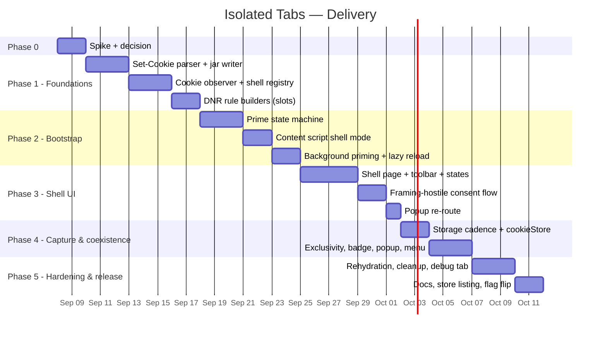

# 6 — Implementation Plan: Approach C (Isolated Tabs)

**Version:** 0.1.0 (proposal)
**Status:** Blocked on `5-Spike-Plan.md` go decision
**Last Updated:** 2026-09-02

---

## 1. Scope

Deliver **isolated tabs** on Chromium 110+ as a second mode next to the sequential model, exactly as specified in `3-Approach-C-Credentialless-Shell.md`. Every phase ends in a shippable state behind a feature flag; the flag flips to visible in Phase 5.

Out of scope for this plan (tracked as follow-ups in §9): multi-frame shells with a shared partition, Firefox container mapping (already Phase 4.1 of `3-implementation-Plan.md`), MAIN-world storage write notifier.

---

## 2. Phase 0 — Spike and decision

Per `5-Spike-Plan.md`. Exit: `5a-Spike-Results.md` written; the decision matrix row is identified; fallbacks F1 / debugger-observation are known to be needed or not. Everything below assumes the first row ("C as specified"); deviations are marked **[F1]** / **[DBG-OBS]** where they change a task.

---

## 3. Phase 1 — Foundations (no UI)

**Goal.** The service worker can capture cookies from a shell tab into the jar and build every DNR rule set. Testable from the Debug tab and unit tests.

### 3.1 `shared/set-cookie.ts`

- [ ] `parseSetCookie(line: string, requestUrl: URL): ParsedCookie | CookieDeletion | null` — RFC 6265bis: name/value (empty name allowed as Chrome does), `Domain` (leading-dot normalisation, host-only flag, reject non-domain-match), `Path` (default-path algorithm), `Expires`/`Max-Age` precedence, `Secure`, `HttpOnly`, `SameSite` (`Strict`/`Lax`/`None`/unspecified), `Partitioned`, `Priority`; ignore unknown attributes; size guard.
- [ ] `toChromeCookie(parsed, requestUrl): chrome.cookies.Cookie` with `storeId: 'shell'`, `hostOnly`, `session`, `expirationDate` (seconds).
- [ ] `serializeSetCookie(cookie: chrome.cookies.Cookie): string` — the inverse, used for seeding. Host-only cookies omit `Domain`; `Expires` as HTTP-date; skip expired.
- [ ] Tests: `tests/shared/set-cookie.test.ts` — table-driven from the RFC examples + Chrome edge cases (leading dot, uppercase attributes, quoted values, `Max-Age=0`, past `Expires`, `__Host-` prefix constraints, `SameSite=None` without `Secure`).

### 3.2 `background/jar.ts`

- [ ] `upsertObserved(sessionId, requestUrl, cookies[])` and `deleteObserved(sessionId, requestUrl, deletions[])` — incremental read-modify-write of the `sessionId:origin(requestUrl)` snapshot in `cookie-store.ts`; identity = (name, domain, path); prune expired on write; per-key mutex (bucket-level) so concurrent responses serialize.
- [ ] Undo-buffer semantics preserved: if an update empties a non-empty snapshot, route through the existing `snapshot-undo` put path (same rule as `saveCookies`).
- [ ] `computeSeedSet(sessionId, host): chrome.cookies.Cookie[]` — union over all `sessionId:*` buckets of cookies whose domain matches `host` (host-only for `host`; domain cookies for `host` and parents), not expired, deduplicated by identity (newest wins).
- [ ] Storage write failures go through `recordStorageWriteError` (never swallowed) — same rule as everywhere else.
- [ ] Tests: `tests/background/jar.test.ts` with fake-indexeddb — upsert/delete/expiry/dedup/seed-set hierarchy/undo interplay.

### 3.3 `background/cookie-observer.ts`

- [ ] Top-level `chrome.webRequest.onHeadersReceived.addListener(handler, {urls:['<all_urls>']}, ['responseHeaders','extraHeaders'])` registered from `service-worker.ts` synchronously (before any `await`).
- [ ] Handler: early-return unless `isShellTab(details.tabId)` (synchronous check against the hydrated registry; if the registry is not yet hydrated, **queue** the event and drain after hydration — never drop).
- [ ] Extract `set-cookie` headers (case-insensitive, multiple), call `jar.upsertObserved/deleteObserved`.
- [ ] Emit internal events: `primerResponse(tabId, url, status)`, `framingHostile(tabId, frameUrl, headers)` (XFO present or CSP containing `frame-ancestors`, `sub_frame` only), `frameError(tabId, url)` from `onErrorOccurred`.
- [ ] **[DBG-OBS]** Alternative module `cookie-observer-cdp.ts` with the same interface, using `chrome.debugger` `Network.responseReceivedExtraInfo` per shell tab.
- [ ] Tests: handler with mocked `details` — routing, non-shell early-return, header extraction, queue-before-hydration.

### 3.4 `background/shell-manager.ts` (registry only in this phase)

- [ ] `ShellTabState` registry, `chrome.storage.session` key `STORAGE_KEYS.SHELL_TABS`, ensure-hydrated shared-promise pattern (as `tab-tracker.ts`).
- [ ] `registerShell`, `unregisterShell`, `isShellTab`, `getShellState`, `listShells(sessionId?)`.
- [ ] `TAB_MAP` integration: shell tabs get a `TabSessionEntry` with `mode: 'shell'` and `origin` = current frame origin, so badge/counts work unchanged.
- [ ] `chrome.tabs.onRemoved` → unregister + `removeShellRules`.

### 3.5 `background/dnr-manager.ts` additions

- [ ] `SHELL_RULE_ID_BASE`, `shellRuleId(tabId, slot)`; slot enum per `3-…` §6.
- [ ] `buildPrimerRules(tabId, host, seedCookies)`, `buildEmbedRules(tabId, allowlist)`, `buildCacheGuardRule(tabId)` (flagged by H7), `removeShellRules(tabId)`.
- [ ] `cleanupStaleRules` extended to sweep the shell id range for dead tabs.
- [ ] Tests: rule shapes (conditions, `requestDomains` never `urlFilter: ||`, `tabIds`), slot allocation, sweep.

### 3.6 Types, constants, manifest

- [ ] `shared/types.ts`: `TabMode`, `TabSessionEntry.mode`, `PrimeState`, `ShellTabState`, new `MessageType`s (§7) and their message/result interfaces; `ExtensionSettings.embedAllowlist`, `isolatedTabPopups`.
- [ ] `shared/constants.ts`: `STORAGE_KEYS.SHELL_TABS`, `SHELL_RULE_ID_BASE`, `SHELL_PRIMER_QUERY = 'us-prime=1'`, `SHELL_PRIMER_TIMEOUT_MS = 3000`, `SHELL_STORAGE_CAPTURE_INTERVAL_MS = 10000`, `SHELL_MAX_BACKGROUND_PRIMERS = 2`.
- [ ] `manifest.json`: `webRequest`, `webNavigation`; `content_scripts[0].all_frames: true`; extension-pages CSP with explicit `frame-src https: http:`.
- [ ] Feature flag: `ExtensionSettings.isolatedTabsEnabled` (default `false` until Phase 5) + runtime detect `'credentialless' in HTMLIFrameElement.prototype`.

**Exit criteria.** Type-check, svelte-check, lint, format, tests green. Debug tab shows observer counters (responses seen / shell responses / cookies captured). A hand-made shell page (from the spike) with the registry populated captures cookies into the jar.

---

## 4. Phase 2 — Bootstrap

**Goal.** A shell tab primes a fresh partition from the jar deterministically and then loads the target URL logged in.

### 4.1 Prime state machine (`shell-manager.ts`)

- [ ] `prime(tabId, origin)` → state `priming`, install PRIMER rules, resolve when `PRIMER_DONE` arrives or on error/timeout; always remove PRIMER rules before resolving; state `seeded`/`unseeded`.
- [ ] Serialization: one primer at a time per tab (queue); the visible frame's origin is always first.
- [ ] `SHELL_PRIME` handler returns `{seedCount, storageRestored, tookMs, outcome}` for the shell's UI and logs at `info`.
- [ ] Lazy path: on `webNavigation.onCommitted` (frameId ≠ 0, shell tab) for an origin with data in state `unseeded` → prime in a helper (or, if H3 failed, in place) → one reload guarded by `reloadedOnce`.
- [ ] **[F1]** `prime` attaches `chrome.debugger` to the shell tab once, enables `Fetch` Request-stage merging for the tab's lifetime; PRIMER_SEED rule not used.

### 4.2 Content script shell mode (`content/index.ts`, new `content/shell-mode.ts`)

- [ ] Mode detection at first statement; inert in non-shell subframes.
- [ ] Primer protocol: `SHELL_PRIMER_READY` → payload → `localStorage.clear()`, existing restore functions, IndexedDB restore with the existing size/time bounds → `SHELL_PRIMER_DONE {stats}`.
- [ ] Frame reporting `SHELL_FRAME_EVENT` (commit/title/favicon).
- [ ] Tests: jsdom-based tests for mode detection and the primer message sequence (mock `chrome.runtime`).

### 4.3 Background priming

- [ ] Shell requests the plan (`SHELL_REGISTER` result lists origins with data, primary first).
- [ ] Shell creates hidden `<iframe credentialless>` helpers, ≤ `SHELL_MAX_BACKGROUND_PRIMERS` concurrently, removes each after `SHELL_PRIMED`.
- [ ] Manager tracks helper primes per origin; a lazy commit for an origin currently priming waits instead of re-priming.

**Exit criteria.** With the spike shell page: open session S on the controlled origin → `/echo` shows every seeded cookie; `/storage` shows restored localStorage/IDB/sessionStorage before its first script; a second origin with data loads logged in without reload (H3) or with exactly one reload (¬H3). No PRIMER rule survives a navigation to the target URL (assert via `getSessionRules()` in tests).

---

## 5. Phase 3 — Shell UI

**Goal.** A real product surface.

### 5.1 `src/shell/`

- [ ] `index.html`, `main.ts`, `App.svelte`; components `ShellToolbar.svelte`, `SessionChip.svelte`, `ShellState.svelte` (priming / blocked / error / stale), reuse `shared/components` (Icon, ThemeToggle, ConfirmDialog, Toast).
- [ ] Hash routing `#sid&url`; `document.title` mirrors frame title; favicon mirroring via `<link rel=icon>` swap.
- [ ] iframe attributes per `3-…` §9; `allow` list trimmed to what H8 showed works.
- [ ] Back/Forward via `history`, Reload via `src` re-assign, address field navigation, `chrome.commands` for focus-address (`Ctrl/Cmd+L` equivalent — declared in manifest `commands`).
- [ ] Loading indicator driven by `webNavigation` events relayed by the manager (`SHELL_STATE_CHANGED` push via `chrome.runtime.sendMessage` to the shell tab, or shell polling `SHELL_GET_STATE` on visibility).
- [ ] a11y: named controls, `aria-live` for state changes, focus management, 44 px targets, theme tokens only.

### 5.2 Framing-hostile consent

- [ ] Observer → manager → shell: blocked card with the exact header(s) seen and the scope statement.
- [ ] Consent → `embedAllowlist` (eTLD+1 via `extractDomain`) → EMBED rules for all open shells → frame reload.
- [ ] Settings tab: "Embedding allowed in isolated tabs" list with revoke; revoke removes rules immediately.
- [ ] CSP handling per the implementation-time choice (`remove` vs `responseHeaders`-conditioned `remove`); copy reflects the choice.

### 5.3 Popup re-route

- [ ] `chrome.tabs.onCreated` with `openerTabId ∈ shells` and `isolatedTabPopups === 'reroute'` → `chrome.tabs.remove(newTab)` + `SHELL_OPEN {sessionId, url: pendingUrl ?? url}`; toast in the new shell with *Undo → open normally*.
- [ ] Guard: only when `pendingUrl` is http(s); never re-route `chrome-extension://` or `about:` tabs.

**Exit criteria.** svelte-check zero warnings; keyboard-only operation of the shell; blocked-site flow on the controlled origin `/xfo`, `/csp`; Gmail per H6 outcome.

---

## 6. Phase 4 — Capture cadence and coexistence

### 6.1 Storage capture

- [ ] Shell-mode timer (10 s, visible only, change-detected), `visibilitychange`, `pagehide`; payload via existing `SAVE_STORAGE` handler → `storage-store` under `S:origin`.
- [ ] `cookieStore` change bridge → `jar.upsertObserved/deleteObserved`.
- [ ] Auto-save alarm (`auto-refresh.ts`) includes shell tabs: requests storage capture from the frame; cookies need nothing (already continuous).
- [ ] Popup "Save now" on a shell tab triggers the same.

### 6.2 Exclusivity and entry points

- [ ] `switchSession`/`ASSIGN_TAB` on a normal tab: if `listShells(targetSessionId)` has a shell whose frame origin equals the tab origin → reject with a typed error; popup shows the toast with "Focus isolated tab".
- [ ] `SHELL_OPEN` for `S` when a **normal** tab is bound to `S` on the same origin → reject symmetrically ("Session S is active in a normal tab").
- [ ] Popup: "Open in isolated tab" action on session rows (more-actions menu + `Shift+1–9`), `CurrentTabPanel` shows frame origin + "Isolated" chip for shell tabs, session switching disabled there.
- [ ] Context menu: "Open link in isolated tab → \<session\>" submenu (`context-menu.ts`, rebuilt on session changes as today).
- [ ] `GET_SESSION_FOR_TAB` returns shell state for shell tabs; `getTabsForSession` counts them.
- [ ] Badge: unchanged (TAB_MAP-driven) — verify.

**Exit criteria.** All existing 618+ tests still pass; new tests for exclusivity; manual: sequential model behaviour on normal tabs byte-for-byte unchanged (compare Debug tab cookie diff before/after on a normal-tab switch).

---

## 7. Message types (additions to `MessageType`)

| Type | Direction | Payload → Result |
|---|---|---|
| `SHELL_OPEN` | popup/options/menu → SW | `{sessionId, url}` → `{tabId}`; idempotency: caller passes `requestId`; SW dedups for 5 s |
| `SHELL_REGISTER` | shell → SW | `{tabId, sessionId, url}` → `{plan: string[], state: ShellTabState}` |
| `SHELL_PRIME` | shell → SW | `{origin}` → `{outcome, seedCount, storageRestored, tookMs}` |
| `SHELL_PRIMER_READY` | content (primer) → SW | `{origin}` → storage payload |
| `SHELL_PRIMER_DONE` | content (primer) → SW | `{origin, stats}` → `{}` |
| `SHELL_FRAME_EVENT` | content → SW | `{kind, url, title?, favicon?}` → `{}` |
| `SHELL_COOKIE_CHANGE` | content → SW | `{url, changed[], deleted[]}` → `{}` |
| `SHELL_GET_STATE` | shell/popup → SW | `{tabId}` → `ShellTabState` |
| `SHELL_NAVIGATE` | shell → SW | `{url}` → `{}` (updates registry/hash; the shell sets `src`) |
| `SHELL_ALLOW_EMBED` | shell/options → SW | `{site, allow: boolean}` → `{}` |
| `SHELL_LIST` | popup/options → SW | `{sessionId?}` → `ShellTabState[]` |

All mutating messages follow the idempotency rule in `CLAUDE.md` (client-generated ids where a retry could duplicate).

---

## 8. Phase 5 — Hardening and release

- [ ] SW restart: registry rehydration, observer queue drain, rule sweep, `webNavigation` events for existing shells after wake.
- [ ] Error paths: primer offline/timeout, storage quota during restore (`recordStorageWriteError`), DNR rule-limit warnings (`checkRuleCapacity`), closed tab mid-prime, helper iframe failure.
- [ ] Debug tab: "Isolated tabs" card — shells, per-origin prime state, observer counters, last 50 captured cookie identities (names/domains only, never values), rule count in the shell range.
- [ ] Logging: `info` on open/prime/consent/re-route, `warn` on primer degradation, `error` on write failures — following `logger.ts` levels.
- [ ] Performance check per H9 threshold on the release build.
- [ ] Docs: `CLAUDE.md` (new modules, invariants: observer registered synchronously; no request-side rules in steady state; exclusivity rule; primer rules never outlive priming), `README.md` feature section, `CHANGELOG.md`, `2-Product-Specifications.md` §2/§3/§9 (constraint reworded: "one active session per origin **per partition**"), `PRIVACY_POLICY.md` (webRequest usage: header observation for isolated tabs only, no network calls added).
- [ ] Store listing: new permissions justification text; screenshots of the shell.
- [ ] Flip `isolatedTabsEnabled` default to `true`; onboarding hint in the popup's empty state.

**Exit criteria.** Quality gate (`CLAUDE.md`) green; H11 scenario repeated on the release build on Chrome, Edge, Brave; no change in behaviour for users who never open an isolated tab.

---

## 9. Follow-ups (not in this plan)

| Item | Why later |
|---|---|
| Multi-frame shell (tab strip inside one shell; shared nonce → live shared state per session) | UX-heavy; validate demand after v1 |
| MAIN-world storage write notifier (event-driven storage capture) | Only if the 10 s window proves problematic |
| Firefox: map "Open in isolated tab" to `contextualIdentities` | Already `3-implementation-Plan.md` 4.1 |
| Import of embedding allowlist presets (e.g. Google) | After H6 data |
| Per-session proxy in isolated tabs | `2-Product-Specifications.md` §10.2 |

---

## 10. Risk register

| Risk | Likelihood | Impact | Mitigation | Status |
|---|---|---|---|---|
| H1 fails → debugger needed for bootstrap | Medium | Medium (infobar on isolated tabs, `debugger` permission) | F1 designed; isolated tabs only | Open until spike |
| Observer overhead on all tabs | Low–Medium | Medium | H9 threshold; debugger-scoped fallback | Open until spike |
| Google sign-in refuses embedded contexts even with headers removed | Medium | High for Google users | Login-in-normal-tab-first path; documented | Open until spike |
| Store review objects to `webRequest`/`webNavigation` or to header removal | Low | High | Permissions justification; consent-scoped header removal; open-source audit trail | Mitigated |
| Missed `Set-Cookie` while SW hydrates | Low | High (unrecoverable) | Queue-before-hydration in the observer; synchronous top-level registration | Mitigated by design |
| Primer rules leak into the real page (CSP `default-src 'none'`) | Low | High (blank page) | State machine removes rules before `SHELL_PRIMED`; test asserts no PRIMER rules after prime | Mitigated by design |
| User confusion (address bar shows extension URL) | High | Medium | Toolbar with real URL, session chip, onboarding hint, "Open normally" escape hatch | Accepted |
| Sequential model regressions from `all_frames: true` | Low | High | Inert-in-subframes guard as the first statement; regression tests | Mitigated by design |
| Two shells of one session diverge | Medium | Low | Per-cookie merge (last writer wins); UI hint; multi-frame shell later | Accepted |
