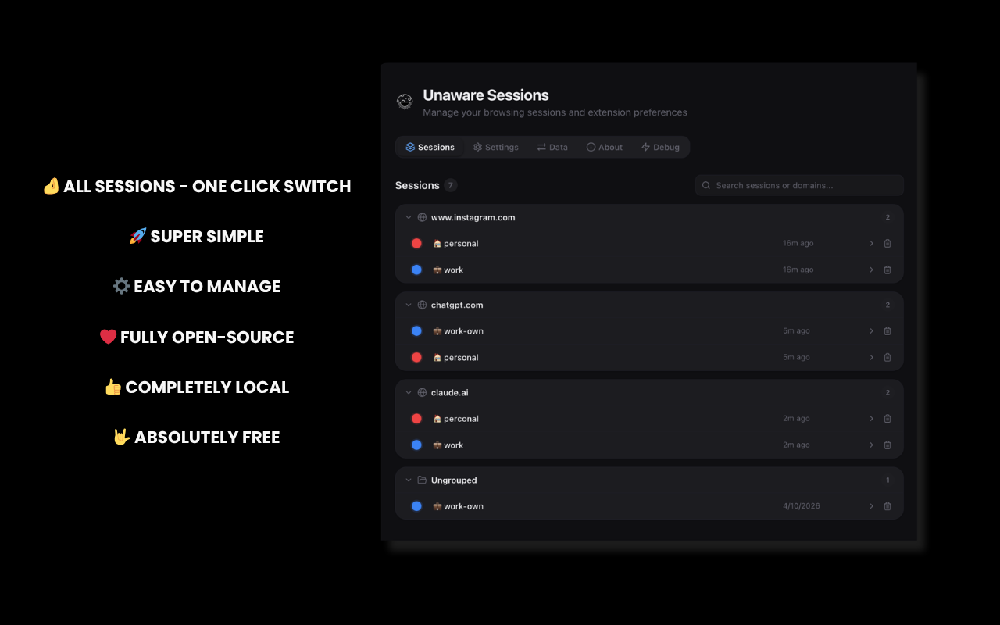
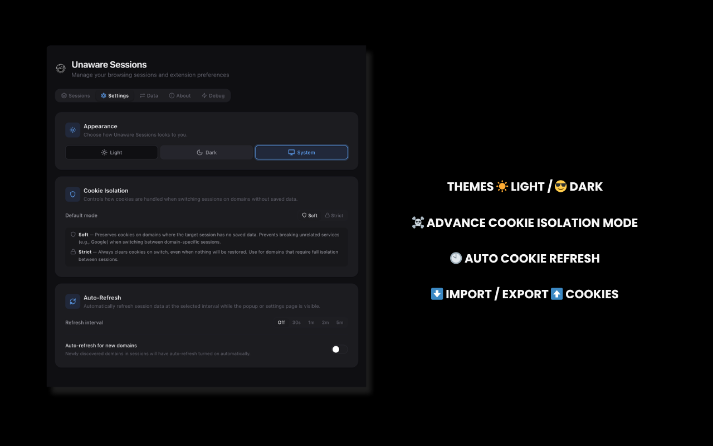
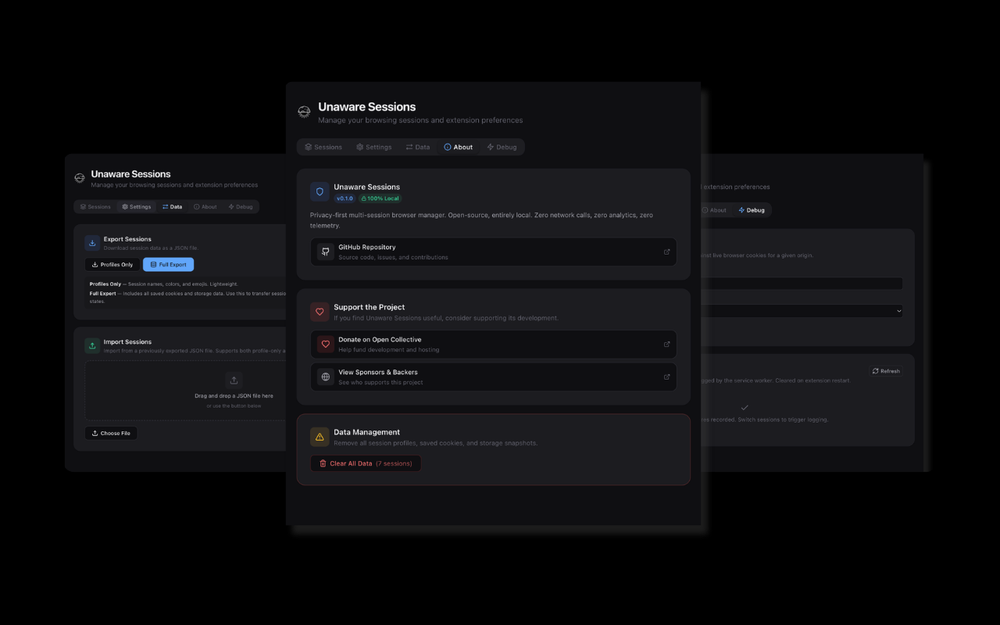
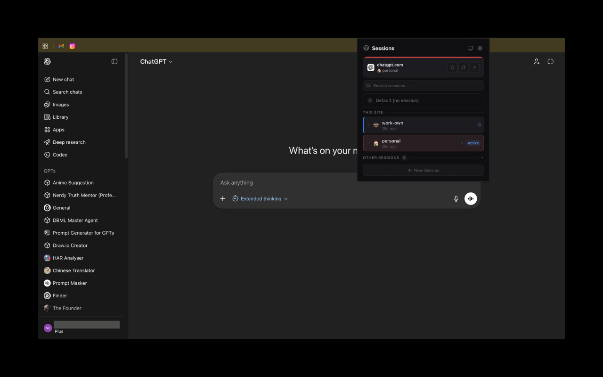
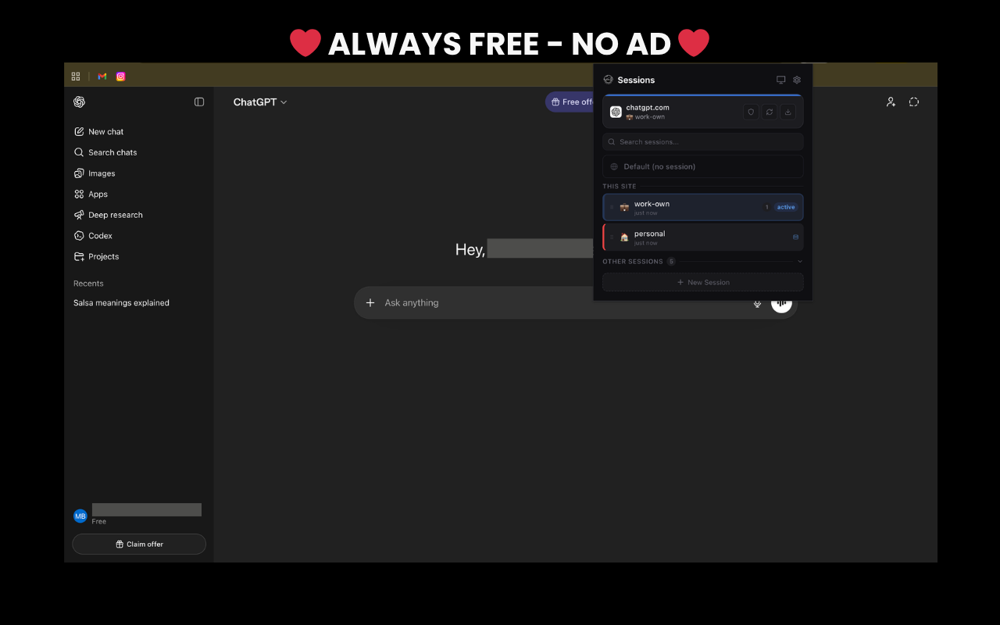
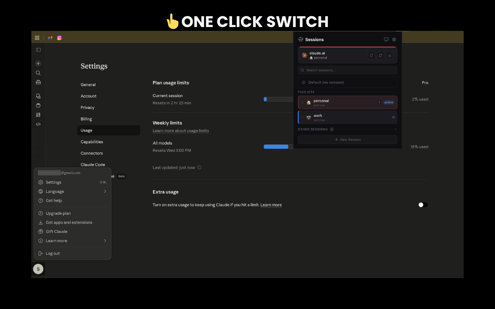
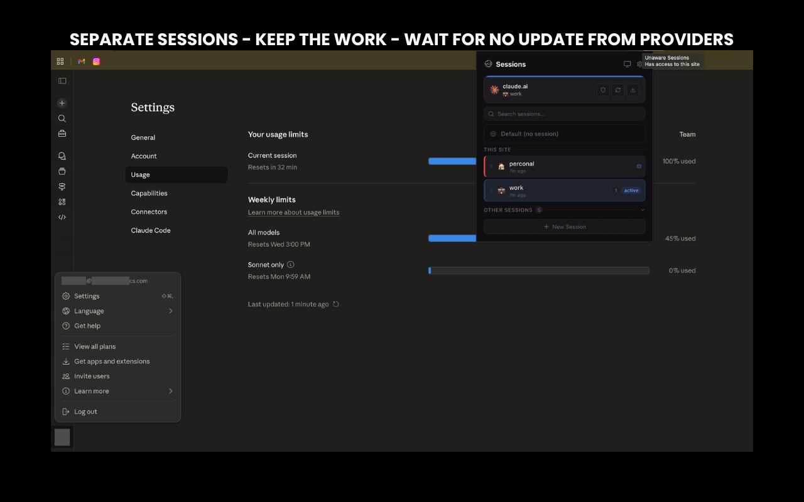
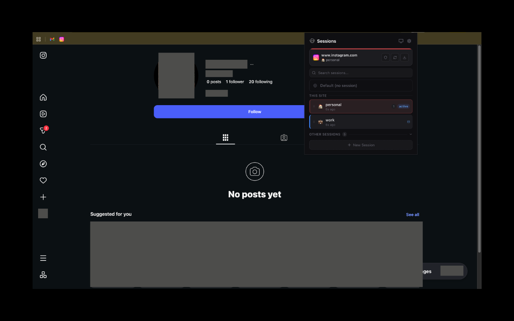
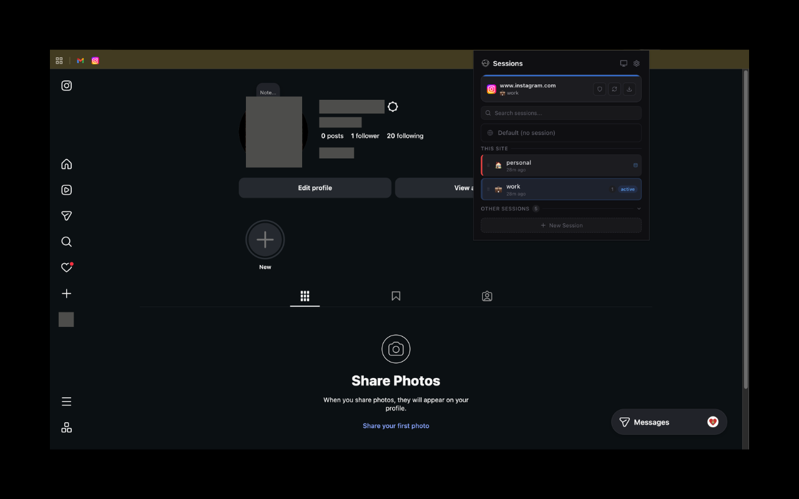
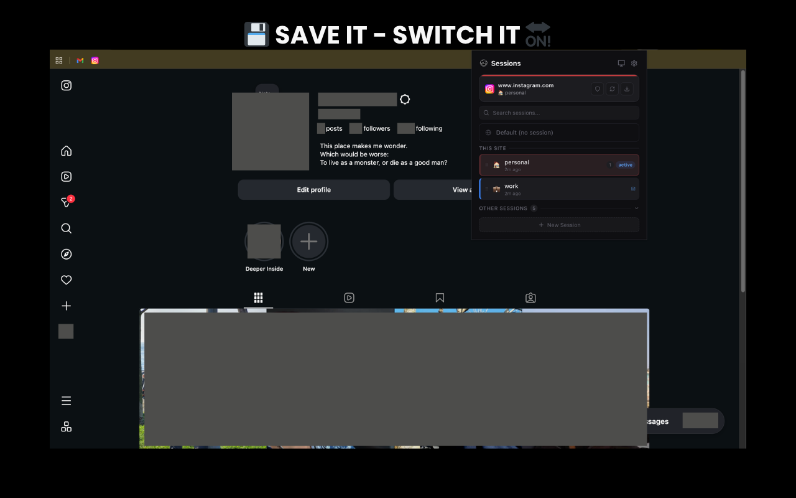

# Unaware Sessions Browser Extension

**Open-source, privacy-first multi-session browser manager — entirely local.**







---

## Table of Contents

- [Project Overview](#project-overview)
- [Motivation](#motivation)
- [Features](#features)
- [Screenshots](#screenshots)
- [Architecture Overview](#architecture-overview)
- [Tech Stack](#tech-stack)
- [Installation](#installation)
- [Usage](#usage)
- [Project Structure](#project-structure)
- [Development](#development)
- [Testing](#testing)
- [Contributing](#contributing)
- [Support](#support)
- [Privacy Policy](#privacy-policy)
- [License](#license)

---

## Project Overview

Unaware Sessions lets you run multiple isolated browser sessions side-by-side within a single browser window. Each tab operates in its own sandboxed context with separate cookies, localStorage, sessionStorage, and IndexedDB — no telemetry, no subscriptions. Everything lives on your machine by default, with opt-in encrypted Google Drive sync.

Think of it as SessionBox, but open-source and privacy-first by design.

---

## Motivation

Managing multiple accounts on the same service (Gmail, Twitter, dev/staging/prod environments, client dashboards) is a daily reality for developers, QA engineers, social media managers, and freelancers. The existing solutions come with trade-offs:

- **SessionBox** is proprietary, requires an account, syncs data to external servers, and locks advanced features behind a paywall.
- **Browser profiles** (Chrome, Firefox) are heavyweight — each profile is a separate OS-level process with its own window, history, and extensions.
- **Incognito / Private windows** don't persist sessions and can't run in parallel with identity separation.
- **Multi-Account Containers** (Firefox) are the closest native solution but are Firefox-only and lack cross-browser portability.

Unaware Sessions fills the gap: lightweight session isolation that works inside your existing browser, stores nothing remotely, and is fully auditable.

---

## Features

### Core

- Create named, color-coded session profiles (e.g., `work-gmail`, `client-A`, `staging`)
- Each profile gets its own isolated cookie jar, localStorage, and sessionStorage
- Open any link in any session context via right-click context menu
- Tab badge indicators showing which session a tab belongs to
- Switch a tab's session identity with automatic page reload
- Cookie isolation modes: **soft** (default, preserves unmanaged domains) or **strict** (full isolation)
- Per-domain isolation mode overrides via settings

### Management

- Full backup/restore: export all sessions + cookies + storage as timestamped JSON
- Import / export session profiles as JSON with visual diff preview
- Drag-and-drop file import
- Session list with active tab counts, color indicators, and pinning
- Rename (double-click), delete (with undo), and duplicate session profiles
- Drag-to-reorder sessions
- Per-session storage usage dashboard
- Search/filter bar for large session lists
- Right-click context menu on sessions (rename, duplicate, pin, delete)

### UI & Accessibility

- Dark mode with system preference detection (light / dark / system)
- CSS custom properties design system — no external CSS framework
- Glassmorphism card design with session color accents
- SVG icon set (Lucide) replacing all Unicode symbols
- Emoji avatars for sessions
- Keyboard shortcuts: `n` (new), `/` (search), `?` (quick-switch), `Escape` (close)
- Quick-switch overlay — press `?` then a number key to jump to a session
- First-run onboarding flow
- Full ARIA labels, focus rings, `prefers-reduced-motion`, and `prefers-contrast` support
- Keyboard-navigable tab bar in options page (arrow keys, ARIA tab roles)

### Debugging

- Debug tab in options page with cookie diff viewer (snapshot vs live browser cookies)
- Restore failure log: recent cookie restoration failures with detailed context
- Per-cookie status breakdown: matched, value changed, flags changed, missing, extra, expired

### Security

- Optional 4-digit passcode to protect session switching, deletion, and data export
- Optional biometric authentication (fingerprint / Face ID) via WebAuthn platform authenticator
- Passcode hashing with PBKDF2-SHA256 (600,000 iterations) — never stored in plain text
- Configurable grace period (1–30 minutes) to skip re-authentication after a successful check
- Biometric requires passcode as prerequisite — always recoverable via PIN
- "Forgot Passcode?" reset clears security settings without deleting session data
- Rate limiting: 5 failed attempts triggers a 30-second cooldown

### Cloud Sync (opt-in)

- Encrypted Google Drive sync using AES-256-GCM (PBKDF2 key derivation, 600K iterations)
- Encryption key derived from Google User ID — same account on any device can decrypt
- Uses `drive.appdata` scope — hidden app folder only, cannot access user files
- Three merge strategies: Trust Cloud, Trust Local, Ask (per-origin conflict picker)
- Configurable auto-sync interval (Off / 5m / 15m / 30m) via `chrome.alarms`
- Decryption failures auto-recover by overwriting remote with local data
- Connect/disconnect from Settings → Cloud Sync card

### Privacy

- Zero analytics, no crash reporting, no telemetry, no update pings beyond the browser's own extension update mechanism
- All data stored locally by default; Google Drive sync is opt-in and encrypted
- Drive sync uses `drive.appdata` scope — extension cannot access any user files

### Design Constraints

- **One session per origin at a time** — DOM storage is shared per-origin, so concurrent sessions on the same domain aren't possible at the extension level
- **Page reload on session switch** — required to cleanly swap DOM storage without race conditions
- **Manifest V3 only** — mandatory for Chrome Web Store distribution

---

## Screenshots

### Popup — Session Switching

Switch between isolated sessions on any site. Each session maintains its own cookies, localStorage, and IndexedDB.

#### ChatGPT

| Personal Session | Work Session |
| ---------------- | ------------ |
|  |  |

#### Claude

| Personal Session | Work Session |
| ---------------- | ------------ |
|  |  |

#### Instagram

| Personal Session | Work Session |
| ---------------- | ------------ |
|  |  |
|  | |

---

## Architecture Overview

```text
+-----------------------------------------------------------+
|                      Extension                             |
|                                                            |
|  +------------------+   +--------------------+             |
|  | Popup UI (Svelte)|   | Options (Svelte)   |             |
|  +--------+---------+   +--------+-----------+             |
|           |                      |                         |
|           v                      v                         |
|  +--------------------------------------------+            |
|  |         Service Worker (Background)         |            |
|  |  - Session Manager                          |            |
|  |  - Cookie Engine (swap/save/restore)        |            |
|  |  - Tab Tracker                              |            |
|  |  - DNR Manager (declarativeNetRequest)      |            |
|  |  - Message Router                           |            |
|  |  - Drive Sync (encrypted backup)            |            |
|  +-----+------------------+-------------------+            |
|        |                  |                                |
|        v                  v                                |
|  +-----------+    +----------------+                       |
|  | Content   |    | Internal Store |                       |
|  | Scripts   |    | (IndexedDB +   |                       |
|  | (per-tab) |    |  chrome.storage)|                      |
|  +-----------+    +----------------+                       |
+-----------------------------------------------------------+
         |                  |
         v                  v
  +-------------+   +----------------+
  | Browser APIs|   | chrome.cookies |
  | (tabs, DNR) |   | (per-domain)   |
  +-------------+   +----------------+
```

### Session Switch Flow (Chromium)

1. User selects "Switch to Session B" in popup
2. Service Worker saves current session's cookies and triggers content script to save DOM storage (localStorage, sessionStorage, IndexedDB)
3. Service Worker clears origin cookies and restores Session B's cookies
4. Service Worker queues a pending storage restore and reloads the tab
5. Content script at `document_start` sends `CONTENT_SCRIPT_READY` to Service Worker
6. Service Worker sends Session B's DOM storage to content script for restoration
7. Badge updates to reflect new session

### Platform Strategy

| Platform | Isolation Method |
| -------- | ---------------- |
| Chromium (Chrome, Edge, Brave) | Snapshot & Swap — cookie API + content script storage swap + DNR rules |
| Firefox | `contextualIdentities` API for native container isolation |

### Data Model

| Entity | Storage Location | Purpose |
| ------ | ---------------- | ------- |
| Session profiles | `chrome.storage.local` | Name, color, settings (survives browser restart) |
| Tab-session mapping | `chrome.storage.session` | Which tab belongs to which session (survives SW restart) |
| Storage snapshots | Extension IndexedDB | localStorage, sessionStorage, IndexedDB snapshots per session per origin |
| Cookie snapshots | Extension IndexedDB | Saved cookie jars per session per origin |

---

## Tech Stack

| Layer | Technology | Role |
| ----- | ---------- | ---- |
| Extension Runtime | WebExtensions API (MV3) | Cross-browser extension framework |
| UI Framework | Svelte 5 | Popup, options page (runes-based reactivity) |
| Build System | Vite + @crxjs/vite-plugin | Dev server, HMR, Chrome extension bundling |
| Language | TypeScript | End-to-end type safety (strict mode) |
| Internal Storage | chrome.storage.local + IndexedDB | Session profiles + storage snapshots |
| Styling | CSS Custom Properties | Design system with light/dark themes, no CSS framework |
| Testing | Vitest + fake-indexeddb | Unit tests with Chrome API mocks |
| Linting | ESLint + Prettier | Code quality |

---

## Installation

### Prerequisites

- **Node.js** 18+ (LTS recommended)
- **npm** 9+ (ships with Node.js)
- **Google Chrome** (or any Chromium-based browser) / **Firefox**

### Build from Source

```bash
# Clone the repository
git clone https://github.com/msaidbilgehan/unaware-sessions-browser-extension.git
cd unaware-sessions-browser-extension

# Install dependencies
npm install

# Build the extension
npm run build
```

### Load into Chrome

1. Open `chrome://extensions/` in Chrome.
2. Enable **Developer mode** (toggle in the top-right corner).
3. Click **Load unpacked**.
4. Select the `dist/` folder from the project root.
5. The Unaware Sessions icon appears in your toolbar — click it to open the popup.

### Load into Firefox

1. Open `about:debugging#/runtime/this-firefox` in Firefox.
2. Click **Load Temporary Add-on**.
3. Select `dist/firefox/manifest.json`.

### Development Mode (HMR)

```bash
npm run dev
```

This starts a Vite dev server with hot module replacement. Load the extension from the `dist/` folder as above — changes in source files reflect immediately without manual reload.

### Open the Popup

Press `Alt+Shift+B` (the default keyboard shortcut) to open the Unaware Sessions popup from any tab.

---

## Usage

1. Click the Unaware Sessions icon in the toolbar.
2. Hit **+ New Session** — give it a name and pick a color.
3. Right-click any link and select **Open in Session** to choose your session.
4. The tab opens with a colored badge. Cookies and storage are fully isolated.
5. Create more sessions as needed. Switch any tab between sessions from the popup (triggers page reload).

---

## Project Structure

```text
src/
  background/
    service-worker.ts        # SW entry point, lifecycle, hydration
    session-manager.ts       # Session CRUD, ordering, duplicate
    cookie-engine.ts         # Cookie swap + session switch + DOM storage orchestration
    cookie-store.ts          # IndexedDB wrapper for cookie snapshots + stats
    storage-store.ts         # IndexedDB wrapper for storage snapshots + stats
    dnr-manager.ts           # declarativeNetRequest session rules
    tab-tracker.ts           # Tab-session mapping with persistence
    messaging.ts             # Discriminated union message router
    context-menu.ts          # "Open in Session" right-click menu
    badge-manager.ts         # Tab badge with session color + abbreviation
    drive-sync.ts            # Google Drive sync orchestration + auto-sync alarm
  content/
    index.ts                 # Content script entry (document_start)
    storage-swap.ts          # localStorage/sessionStorage save/restore
    idb-swap.ts              # IndexedDB snapshot/restore (best-effort)
    content.css              # Content script styles
  popup/
    index.html
    main.ts                  # Svelte mount + theme init
    App.svelte               # Main popup (380px): sessions, search, keyboard nav
    components/
      SessionList.svelte     # Grouped session list with drag-to-reorder
      SessionItem.svelte     # Session card with color accent, emoji, inline rename
      NewSessionForm.svelte  # Create session form with color + emoji picker
      CurrentTabPanel.svelte # Current tab info + favicon + session switcher
      SearchBar.svelte       # Session search/filter
      ContextMenu.svelte     # Right-click context menu
      SessionDetail.svelte   # Expandable session stats panel
      KeyboardOverlay.svelte # Quick-switch overlay (press ?)
      OnboardingEmpty.svelte # First-run onboarding guide
  options/
    index.html
    main.ts                  # Svelte mount + theme init
    App.svelte               # Tabbed options page (Sessions, Settings, Data, About, Debug)
    components/
      TabBar.svelte          # Tab navigation with keyboard nav + ARIA
      SessionsTab.svelte     # Session management with inline edit
      SettingsTab.svelte     # Theme + cookie isolation + auto-refresh + security + cloud sync
      SyncConflictDialog.svelte # Per-origin local/cloud conflict picker
      ImportExportTab.svelte # Import with drag-drop + visual diff + data management
      AboutTab.svelte        # Version info, GitHub, OpenCollective
      StorageDashboard.svelte # Per-session storage usage bars
      DragDropZone.svelte    # Drag-and-drop file import zone
      ImportDiff.svelte      # Visual diff preview before import
      DebugTab.svelte        # Cookie diff viewer + restore failure log + extension logs with log level selector
  shared/
    types.ts                 # All TypeScript interfaces + message types
    api.ts                   # Typed messaging API (popup + options)
    constants.ts             # Extension-wide constants
    settings-store.ts        # Extension settings manager (auto-refresh, domain prefs, log level)
    security-store.ts        # Security config manager (passcode, biometric, grace period)
    crypto-utils.ts          # PBKDF2 hashing, salt generation, constant-time verification
    auth-check.ts            # Auth requirement check utility
    logger.ts                # Structured logger with configurable levels and in-memory ring buffer
    storage.ts               # chrome.storage typed helpers
    utils.ts                 # Pure utility functions
    theme.css                # CSS custom properties design system
    theme-store.ts           # Theme preference manager
    sync/
      sync-types.ts          # Sync type definitions
      crypto-engine.ts       # AES-256-GCM encrypt/decrypt + PBKDF2 key derivation
      drive-client.ts        # Google Drive REST API v3 wrapper (appDataFolder)
      sync-store.ts          # SyncConfig persistence + listeners
      sync-engine.ts         # Core sync orchestrator (manifest, conflicts, merge)
    components/
      Icon.svelte            # SVG icon library (Lucide paths)
      ThemeToggle.svelte     # Dark mode toggle button
      ConfirmDialog.svelte   # Modal confirmation dialog
      AuthGate.svelte        # Passcode + biometric auth modal
      Toast.svelte           # Toast notifications with undo
      InlineEdit.svelte      # Inline text editing
      ColorPicker.svelte     # Color preset + custom picker
      EmojiPicker.svelte     # Emoji grid selector
      AppLogo.svelte         # Theme-aware extension logo
  assets/
    icons/                   # Extension icons (16, 32, 48, 128)
    Unaware-Sessions-Extension-Icon/  # Brand assets (SVG + PNG, light/dark)
Docs/
  1-Idea.md                  # Project concept and motivation
  2-Product-Specifications.md # Architecture, data model, isolation matrix
  3-implementation-Plan.md   # Phased delivery plan
tests/
  setup.ts                   # Global test setup with Chrome API mocks
  background/                # Service worker module tests
  content/                   # Content script tests
  shared/                    # Shared utility + theme tests
```

---

## Development

### Commands

| Command | Description |
| ------- | ----------- |
| `npm run dev` | Start dev server with HMR |
| `npm run build` | Production build to `dist/` |
| `npm run test` | Run unit tests (Vitest) |
| `npm run test:watch` | Watch mode |
| `npm run test:coverage` | Coverage report (v8) |
| `npm run type-check` | TypeScript strict mode validation |
| `npm run lint` | ESLint check |
| `npm run lint:fix` | ESLint auto-fix |
| `npm run format` | Prettier auto-format |
| `npm run format:check` | Prettier dry-run check |
| `npm run release` | Patch version bump + push tags |
| `npm run release:minor` | Minor version bump + push tags |
| `npm run release:major` | Major version bump + push tags |

### Chrome Permissions

| Permission | Purpose |
| ---------- | ------- |
| `storage` | Persist session profiles and tab mappings |
| `cookies` | Read/write/delete cookies per domain for session swap |
| `tabs` | Track tab lifecycle, reload tabs, update badges |
| `declarativeNetRequest` | Modify cookie headers on outbound requests |
| `contextMenus` | "Open in Session" right-click menu |
| `alarms` | Periodic state persistence, cleanup, and auto-sync |
| `identity` | Google OAuth2 for Drive sync |

---

## Testing

```bash
# Run tests once
npm run test

# Watch mode
npm run test:watch

# With coverage report
npm run test:coverage
```

Tests use **Vitest** with Chrome API mocks (defined in `tests/setup.ts`) and `fake-indexeddb` for IndexedDB testing. Coverage is tracked via v8. The test suite covers background services, shared utilities, content scripts, settings, security, sync engine, Drive client, and API layer (467+ tests across 29 test files, 85%+ statement coverage).

---

## Contributing

### Getting Started

1. Fork the repository and clone your fork.
2. Install dependencies: `npm install`
3. Create a feature branch: `git checkout -b feature/your-feature`
4. Start the dev server: `npm run dev`
5. Load the extension from `dist/` in Chrome.

### Code Quality Gates

Before submitting a pull request, ensure all checks pass:

```bash
npm run type-check   # No TypeScript errors
npm run lint         # No linting violations
npm run format:check # Consistent formatting
npm run test         # All tests pass
```

### Conventions

- **TypeScript strict mode** — no `any`, no implicit types.
- **Entity-per-handler pattern** — each entity domain has its own module in `background/`.
- **Discriminated union messaging** — all messages between contexts use typed discriminated unions (see `shared/types.ts`).
- **No external network calls** — the extension runs entirely locally. No analytics, no telemetry, no external APIs.

### Pull Request Guidelines

- Keep PRs focused — one feature or fix per PR.
- Include tests for new functionality.
- Update relevant types in `shared/types/` when changing entity schemas.
- Test in Chrome with the extension loaded before submitting.

---

## Support

If you find Unaware Sessions useful, consider supporting its development:

[](https://opencollective.com/unaware-sessions-browser-ext)

### Donate

<a href="https://opencollective.com/unaware-sessions-browser-ext/donate" target="_blank">
  
</a>

### Sponsors

Support this project by becoming a sponsor. Your logo will show up here with a link to your website.

<a href="https://opencollective.com/unaware-sessions-browser-ext#sponsor"></a>

### Backers

Thank you to all our backers!

<a href="https://opencollective.com/unaware-sessions-browser-ext#backer"></a>

### Contributors

<a href="https://opencollective.com/unaware-sessions-browser-ext#contributors"></a>

---

## Privacy Policy

Read the full [Privacy Policy](PRIVACY_POLICY.md).

---

## License

This project is licensed under the BSD 3-Clause License. See the [LICENSE](LICENSE) file for details.

Copyright (c) 2026, Muhammed Said Bilgehan. All rights reserved.
